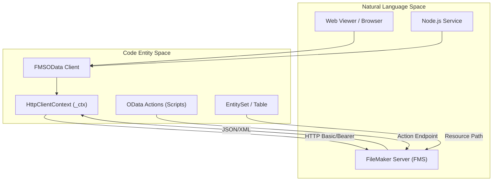
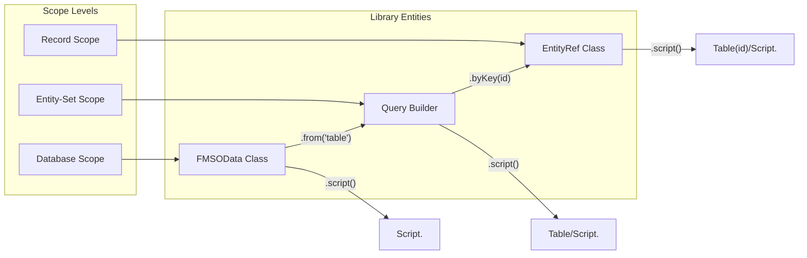

# Overview

`fms-odata-js` is a tiny, type-safe TypeScript client specifically engineered for FileMaker Server's OData v4 API. It provides a fluent interface for data operations, script execution, and record management while abstracting away the specific "quirks" and deviations found in FileMaker's OData implementation.

### Key Design Principles

*   **Zero Runtime Dependencies:** The library is built to be extremely lightweight (~9.1 KB gzipped), ensuring fast load times in restricted environments like the FileMaker Web Viewer [README.md:27-27]().
*   **ESM + IIFE:** Distributed as both an ES module and an IIFE bundle (global `FMSODataLib`), making it compatible with modern build tools, Node.js 18+, direct browser imports, and `<script>` tag inclusion without a bundler [package.json:5-8]().
*   **FileMaker-Aware:** Automatically handles FMS-specific behaviors such as Basic/Bearer auth requirements, specialized date formatting, and script execution envelopes [README.md:30-30]().
*   **Type Safety:** Provides full TypeScript inference for query building and response handling [README.md:28-28]().
*   **Version-Aware:** Detects the FileMaker Server major version (20, 21, 22, 26) from `$metadata` and gates features accordingly [README.md:31-31]().

### System Context

The following diagram illustrates how `fms-odata-js` bridges the gap between JavaScript environments and FileMaker Server.

**Bridge: Environment to Code Entity**

Sources: [README.md:7-12](), [src/http.ts:1-20](), [CHANGELOG.md:14-19]()

---

## Supported Environments

The library is designed to run anywhere modern JavaScript is supported:

*   **FileMaker Web Viewer:** Ideal for building rich UIs that interact directly with the hosted database [README.md:23-23]().
*   **Node.js:** Version 18 or higher is required for native `fetch` support [package.json:48-49]().
*   **Browsers:** Compatible with all modern browsers via ESM.

---

## Core Capabilities

The library organizes FileMaker interactions into three primary scopes: Database, Entity-Set (Table), and Record.

**Bridge: Functional Scopes to Code Entities**

Sources: [CHANGELOG.md:14-19](), [README.md:114-123](), [src/index.ts:1-10]()

| Feature | Description |
| :--- | :--- |
| **Fluent Querying** | Build complex `$filter`, `$select`, `$orderby`, and `$apply` chains using a type-safe builder. |
| **CRUD Operations** | Standard methods for `create()`, `get()`, `patch()`, and `delete()`. |
| **Script Execution** | Trigger FileMaker scripts at database, entity-set, or record scope — by name or by immutable FMSID (v26+). |
| **Containers** | Upload, download, stream, and delete binary data in FileMaker container fields via `ContainerRef`. |
| **Schema Introspection** | Fetch and parse `$metadata` to discover entity types, properties, keys, and actions at runtime. |
| **Batch Requests** | Combine multiple reads and atomic changesets into a single `multipart/mixed` HTTP round-trip via `Batch`. |
| **Version Detection** | Detect FMS major version and gate features with `version()`, `versionInfo()`, `hasFeature()`. |
| **Aggregation** | Server-side `$apply` with `aggregate()` and `groupBy()` (FMS 2024+). |
| **Navigation Properties** | Full `$ref` CRUD — `getRefs`, `addRef`, `setRef`, `removeRef` for OData relationship links. |
| **Multi-Auth** | Basic and Bearer (OAuth / FileMaker Cloud) auth with 401 retry. |
| **Error Handling** | Specialized `FMSODataError` and `FMScriptError` with `isFMSODataError` / `isFMScriptError` type guards. |

---

## Child Pages

For deeper technical details, please refer to the following pages:

### [Getting Started](#1.1)

Step-by-step instructions for installing the library via GitHub or local checkout. Covers initial configuration, including the `.env` setup for development and how to instantiate the `FMSOData` client with `basicAuth`.
For details, see [Getting Started](#1.1).

### [Build System and Distribution](#1.2)

Technical details on the build pipeline using `tsc` and `esbuild`. Explains the distribution artifacts (`.esm.js`, `.esm.min.js`, `.iife.min.js`, and `.d.ts`) and the `sideEffects: false` optimization for tree-shaking.
For details, see [Build System and Distribution](#1.2).

---
Sources: [README.md:1-382](), [package.json:1-61](), [CHANGELOG.md:1-135]()
