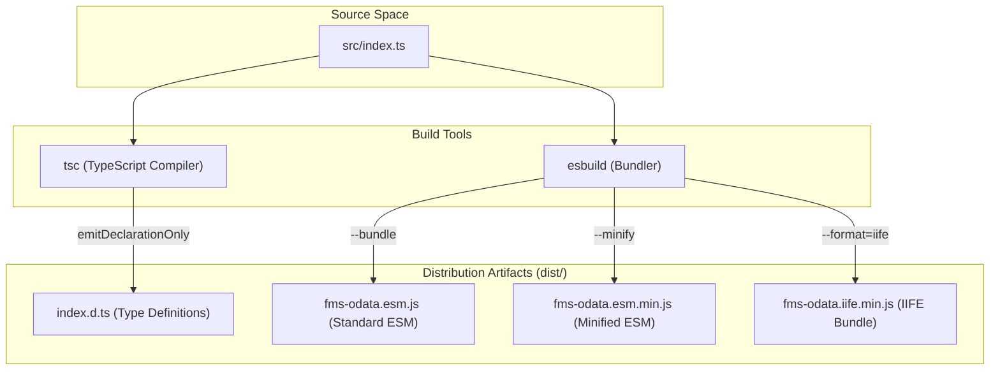
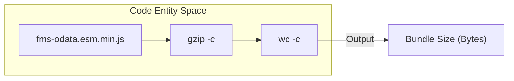

# Build System and Distribution

This page documents the build pipeline and distribution strategy for `fms-odata-js`. The project uses a decoupled build process where TypeScript (`tsc`) handles type definition generation while `esbuild` manages the bundling and minification of the ESM artifacts.

## Build Pipeline Overview

The build process is designed to produce high-performance, tree-shakable ESM modules with zero runtime dependencies. It consists of four primary stages executed via the `npm run build` command [package.json:24-24]().

### Data Flow and Tooling

The pipeline transforms TypeScript source files into three distinct distribution artifacts located in the `dist/` directory.

1.  **Type Generation**: `tsc` is invoked using `tsconfig.build.json` to emit `.d.ts` and `.d.ts.map` files. It is configured with `emitDeclarationOnly: true` to leave JavaScript bundling to `esbuild` [tsconfig.build.json:4-5]().
2.  **ESM Bundling**: `esbuild` bundles the source into a single `fms-odata.esm.js` file, targeting `es2020` [package.json:26-26]().
3.  **Minification**: A secondary `esbuild` pass produces `fms-odata.esm.min.js`, applying minification for production use in environments like the FileMaker Web Viewer [package.json:27-27]().
4.  **IIFE Bundle**: A third `esbuild` pass produces `fms-odata.iife.min.js`, a minified IIFE bundle exposing a global `FMSODataLib` for use in FileMaker Web Viewers and `<script>` tag inclusion without a bundler [package.json:28-28]().

### Build Pipeline Architecture
The following diagram illustrates the transformation from source code to distribution artifacts.

**Build Process Flow**

**Sources:** [package.json:24-28](), [tsconfig.build.json:1-10]()

---

## Distribution Artifacts

The library exports a specific set of files intended for different consumer environments (Node.js, Bundlers, or Browser/Web Viewer).

| Artifact | File Path | Purpose |
| :--- | :--- | :--- |
| **ESM Module** | `dist/fms-odata.esm.js` | Main entry point for modern bundlers and Node.js [package.json:6-7](). |
| **Minified ESM** | `dist/fms-odata.esm.min.js` | Optimized version for Web Viewers to reduce memory overhead (~9.1 KB gzipped) [package.json:27-27](). |
| **IIFE Bundle** | `dist/fms-odata.iife.min.js` | Minified IIFE bundle exposing global `FMSODataLib` for `<script>` tag inclusion without a bundler [package.json:28-28](). |
| **TypeScript Types** | `dist/index.d.ts` | Type definitions for IDE support and type checking [package.json:8-8](). |

The `package.json` uses the `exports` field to ensure that consumers importing the package automatically resolve to the correct type and ESM files [package.json:9-14]().

**Sources:** [package.json:6-14](), [package.json:26-28]()

---

## Tree-Shaking and Side Effects

To ensure the smallest possible bundle size for consumers, the library is marked with `"sideEffects": false` [package.json:22-22](). 

This hint informs bundlers (like Webpack, Rollup, or Vite) that none of the modules in `fms-odata-js` execute code simply by being imported. If a consumer only imports the `Filter` class but not the `FMSOData` client, the bundler can safely remove the client-related code from the final production bundle.

**Sources:** [package.json:22-22]()

---

## Size-Tracking Workflow

Because `fms-odata-js` is frequently used in FileMaker Web Viewers where script injection limits may apply, bundle size is a first-class metric.

### The `size` Script
The project includes a dedicated `size` utility [package.json:35-35](). This script:
1.  Takes the minified artifact (`dist/fms-odata.esm.min.js`).
2.  Compresses it using `gzip`.
3.  Counts the resulting bytes.

This workflow allows developers to verify the "over-the-wire" impact of new features during the PR process.

**Size Tracking Data Flow**

**Sources:** [package.json:35-35]()

---

## Configuration Files

The build system is governed by three TypeScript configuration files that separate concerns between development, testing, and production emitting.

*   **`tsconfig.base.json`**: Contains shared compiler options such as `target: ES2020`, `strict: true`, and `moduleResolution: Bundler` [tsconfig.base.json:3-20]().
*   **`tsconfig.json`**: Used for local development and IDE support. It includes `tests/` and `scripts/` but sets `noEmit: true` to prevent accidental build artifacts [tsconfig.json:1-8]().
*   **`tsconfig.build.json`**: Used strictly for the production build. It limits the scope to the `src/` directory and enables declaration emitting [tsconfig.build.json:1-10]().

**Sources:** [tsconfig.base.json:1-21](), [tsconfig.build.json:1-11](), [tsconfig.json:1-9]()
