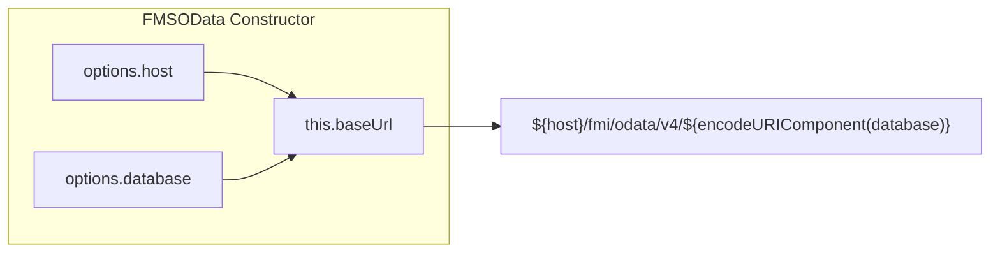
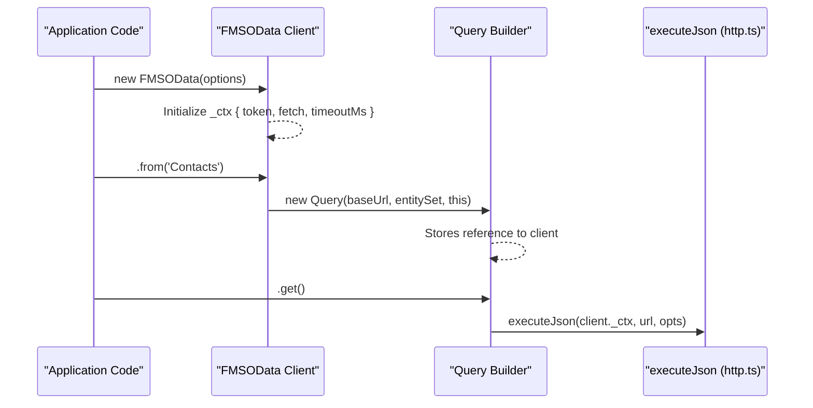
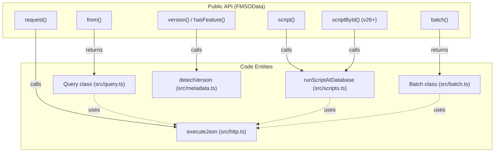

# FMSOData Client

The `FMSOData` class is the central entry point for all operations against a FileMaker Server OData API. It manages connection state, authentication context propagation, and provides high-level methods for querying data and executing scripts.

## Constructor and Configuration

The `FMSOData` class is instantiated with an `FMSODataOptions` object. It validates required parameters and constructs the base URL used for all subsequent database-scoped requests.

### FMSODataOptions

The configuration object requires the target host, database name, and an authentication token.

| Property | Type | Description |
| :--- | :--- | :--- |
| `host` | `string` | The FMS host (e.g., `https://fms.example.com`). Trailing slashes are automatically removed. |
| `database` | `string` | The FileMaker solution name. |
| `token` | `TokenProvider` | A static string or a function/promise returning a Basic or Bearer token. |
| `onUnauthorized` | `() => void \| Promise<void>` | Optional callback for 401 handling. |
| `fetch` | `typeof fetch` | Optional injectable fetch implementation. |
| `timeoutMs` | `number` | Optional default timeout for all requests. |

**Sources:**

- `FMSOData` definition: [src/client.ts:13-13]()
- `FMSODataOptions` interface: [src/types.ts:12-25]()
- Constructor validation: [src/client.ts:21-26]()

### Base URL Construction

The `baseUrl` is computed during instantiation by combining the host and the URL-encoded database name into the standard OData v4 path format.

**Sources:**

- Base URL logic: [src/client.ts:28-30]()

---

## The HttpClientContext Propagation Pattern

Internal state is stored in a private `_ctx` object of type `HttpClientContext`. This context is passed down to every internal module (Query, EntityRef, Scripts) to ensure consistent authentication and fetch behavior without exposing the full `FMSOData` instance to every utility function.

### Context Flow Diagram

This diagram shows how the `_ctx` ([src/client.ts:19-19]()) bridges the client instantiation to the low-level HTTP execution.

**Sources:**

- `_ctx` initialization: [src/client.ts:33-38]()
- `Query` instantiation: [src/client.ts:46-46]()
- Request execution: [src/client.ts:58-60]()

---

## Core Methods

### `from<T>(entitySet: string)`

Initiates a fluent query builder for a specific FileMaker layout (Entity Set). It returns a `Query<T>` instance.

- **entitySet**: The exact name of the FileMaker layout.
- **T**: The TypeScript interface representing the record structure.

**Sources:**

- `from` implementation: [src/client.ts:44-47]()

### `script(name: string, opts: ScriptOptions)`

Invokes a FileMaker script at the **Database Scope**. This means the script runs without a specific layout or record context unless the script itself handles navigation.

- **name**: The name of the FileMaker script.
- **opts**: Contains the `parameter` (string) to pass to the script.

**Sources:**

- `script` implementation: [src/client.ts:80-82]()
- Database scope helper: [src/scripts.ts:3-3]()

### `scriptById(id: number, opts: ScriptOptions)` (v26+)

Invokes a FileMaker script by its immutable FMSID instead of name. This survives script renames and database migrations. Use `hasFeature('scriptsByFMSID')` to check before calling.

- **id**: The internal FileMaker script ID (FMSID).
- **opts**: Contains the `parameter` (string) to pass to the script.

**Sources:**

- `scriptById` implementation: [src/client.ts:84-86]()

### `version()` / `versionInfo()` / `hasFeature(flag)` (v0.2.0)

Detects the FileMaker Server major version from the `Org.OData.Core.V1.ProductVersion` annotation in `$metadata` and caches it for the lifetime of the instance.

- `version()`: Returns `'20' | '21' | '22' | '26' | 'future' | null`
- `versionInfo()`: Returns a full descriptor with feature flags
- `hasFeature(flag)`: Boolean check for a specific feature flag (e.g., `applyAggregation`, `scriptsByFMSID`)

**Sources:**

- `version` implementation: [src/client.ts:88-90]()
- `versionInfo` implementation: [src/client.ts:92-94]()
- `hasFeature` implementation: [src/client.ts:96-98]()

### `batch()`

Returns a `Batch` builder for composing multiple reads and atomic changesets into a single `$batch` HTTP round-trip.

**Sources:**

- `batch` implementation: [src/client.ts:100-100]()

### Low-Level Escape Hatches

For scenarios not yet covered by the fluent API (like `$metadata` or custom OData functions), the client provides raw request methods.

-   **`request<T>(pathOrUrl, opts)`**: Executes a request and parses the response as JSON using `executeJson`. [src/client.ts:58-60]()
-   **`rawRequest(pathOrUrl, opts)`**: Executes a request and returns the standard `Response` object, useful for binary data or stream handling. [src/client.ts:66-68]()

Both methods utilize `_resolveUrl` to allow for either relative paths (e.g., `/Contacts`) or absolute URLs. [src/client.ts:85-89]()

---

## Technical Entity Mapping

The following diagram maps the high-level Client operations to the internal code entities responsible for their execution.

**Sources:**

- `from` to `Query`: [src/client.ts:46-46]()
- `script` to `runScriptAtDatabase`: [src/client.ts:81-81]()
- `scriptById`: [src/client.ts:84-86]()
- `version`/`versionInfo`/`hasFeature`: [src/client.ts:88-98]()
- `batch`: [src/client.ts:100-100]()
- `request` to `executeJson`: [src/client.ts:59-59]()
