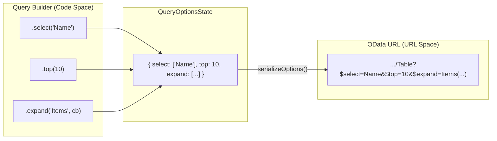
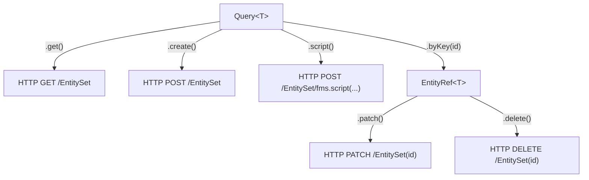

# Query Builder

The `Query<T>` class is a fluent, chainable builder used to construct OData queries against FileMaker entity sets. It accumulates OData system query options (like `$select`, `$filter`, and `$top`) into an internal state and provides terminal methods to execute the request or transition to single-record operations.

### Query Lifecycle

The builder follows a standard "Initialize → Configure → Execute" lifecycle:

1.  **Initialize**: Created via `client.from('Table')`.
2.  **Configure**: Chain methods like `.select()`, `.filter()`, and `.orderby()`.
3.  **Execute**: Call `.get()` to fetch a collection, `.create()` to insert a record, or `.byKey()` to target a specific record.

## Fluent Configuration

The `Query` class provides methods for all standard OData query options. Most methods mutate the internal state and return `this` to allow for fluent chaining.

| Method | OData Parameter | Description |
| :--- | :--- | :--- |
| `select(...fields)` | `$select` | Limits the fields returned in the response. [src/query.ts:145-148]() |
| `filter(input)` | `$filter` | Restricts the result set using logical expressions. [src/query.ts:150-156]() |
| `expand(name, cb)` | `$expand` | Includes related records (Navigation Properties). Supports nested builders. [src/query.ts:166-175]() |
| `orderby(f, dir)` | `$orderby` | Sorts results by field and direction (`asc` or `desc`). [src/query.ts:177-180]() |
| `top(n)` | `$top` | Limits the number of records returned. [src/query.ts:182-189]() |
| `skip(n)` | `$skip` | Offsets the result set (used for paging). [src/query.ts:190-197]() |
| `count(bool)` | `$count` | Requests the total count of matching records. [src/query.ts:198-201]() |
| `search(term)` | `$search` | Performs a full-text search (if supported by the provider). [src/query.ts:203-206]() |
| `apply(expr)` | `$apply` | Sets a raw `$apply` expression for advanced transformations. [src/query.ts:208-211]() |
| `aggregate(exprs)` | `$apply` | Builds `$apply=aggregate(...)` for server-side sum, average, min, max, countdistinct (FMS 2024+). [src/query.ts:213-219]() |
| `groupBy(fields, aggs?)` | `$apply` | Builds `$apply=groupby(...)` for grouping with optional aggregation (FMS 2024+). [src/query.ts:221-235]() |

### Filter System

The `.filter()` method accepts a string, a `Filter` instance, or a callback function that provides a `FilterFactory`. The factory provides a type-safe way to build comparison and logical expressions.

For details, see [Filter System](#2.2.1).

### Nested Expansion

The `.expand()` method allows for deep loading of related entities. You can pass an optional callback to configure the nested query (e.g., selecting specific fields on the related record).

```typescript
// Example of nested expansion
query.expand('Invoices', q => q.select('ID', 'Amount').top(5))
```

Sources: [src/query.ts:166-175](), [dist/query.d.ts:85-85]()

### Aggregation (`$apply`)

The `.aggregate()` and `.groupBy()` methods build server-side `$apply` expressions for aggregation (requires FMS 2024+). Use `hasFeature('applyAggregation')` to check before calling.

```typescript
// Aggregate: sum, average, min, max, countdistinct
query.aggregate([{ field: 'total', function: 'sum', alias: 'totalSum' }])
// $apply=aggregate(total with sum as totalSum)

// Group by with aggregation
query.groupBy(['customerId'], [
  { field: 'total', function: 'sum', alias: 'totalSum' },
  { field: 'total', function: 'average', alias: 'avgTotal' },
])
// $apply=groupby((customerId),aggregate(total with sum as totalSum,total with average as avgTotal))

// Raw $apply for advanced transformations
query.apply('aggregate(total with max as maxTotal)')
```

Sources: [src/query.ts:208-235]()

---

## Internal Model and Serialization

The `Query` builder maintains its state in a `QueryOptionsState` object. This state is eventually serialized into a URL string for the HTTP request.

### QueryOptionsState

This internal interface tracks all configured parameters before they are converted to strings.
Sources: [src/query.ts:106-115](), [dist/query.d.ts:49-64]()

### Serialization Logic

The `toURL()` method converts the internal state into a fully qualified OData URL. It utilizes `serializeOptions()` to handle the conversion of the state object into a query string.

- **Top-level**: Options are joined with `&` and percent-encoded.
- **Nested**: Options inside an `$expand` block are joined with semicolons (`;`) as per OData specifications.

### Mapping Builder to URL Parameters

The following diagram bridges the high-level builder methods to the generated URL structure.

**Query Serialization Flow**



Sources: [src/query.ts:209-213](), [src/query.ts:246-277](), [dist/query.d.ts:123-125]()

---

## Terminal Methods

Terminal methods end the builder chain by either executing an HTTP request or returning a different reference object.

### Collection Operations

-   **`get(opts?)`**: Executes a `GET` request. Returns a `QueryResult<T>` containing the array of records and an optional count. [src/query.ts:231-233]()
-   **`create(body, opts?)`**: Executes a `POST` request to create a new record in the entity set. [src/query.ts:225-227]()
-   **`script(name, opts?)`**: Invokes a FileMaker script at the entity-set scope. Note that filter/sort state is ignored for script execution. [src/query.ts:240-242]()

### Transition to Single Record

-   **`byKey(id)`**: Returns an `EntityRef<T>` for a specific record. This allows for targeted `.patch()`, `.delete()`, or single-record `.get()` operations. [src/query.ts:219-221]()

**Terminal Method Routing**



Sources: [src/query.ts:219-242](), [dist/query.d.ts:93-115]()

---
Sources: [src/query.ts:1-277](), [dist/query.d.ts:1-126](), [README.md:293-318]()
