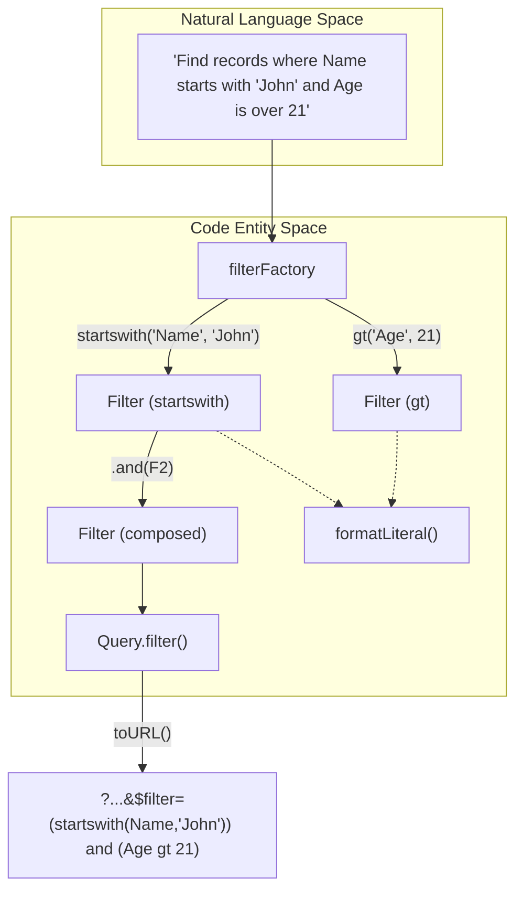
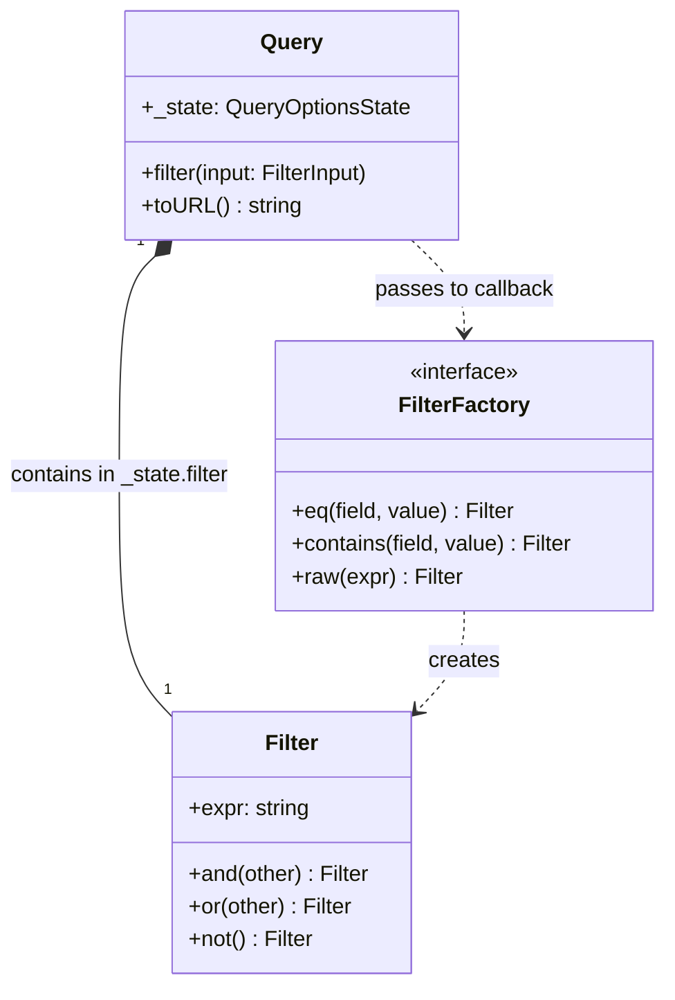

# Filter System

The Filter System provides a type-safe, fluent API for constructing OData `$filter` expressions. It abstracts the complexities of OData syntax—such as manual string quoting, escaping, and logical operator precedence—into a composable object model.

## The Filter Class

The `Filter` class is the primary container for a filter expression string [src/query.ts:30-31](). It provides instance methods for logical composition, allowing developers to chain conditions together.

### Implementation Details

- **Expression Storage**: The raw OData string fragment is stored in the `expr` property [src/query.ts:31]().
- **Logical Composition**: Methods like `.and()`, `.or()`, and `.not()` wrap the current expression and the new fragment in parentheses to ensure correct operator precedence [src/query.ts:37-47]().
- **Coercion**: The static `Filter.coerce()` method allows functions to accept either a `Filter` instance or a raw string, extracting the expression string as needed [src/query.ts:50-52]().

**Sources:** [src/query.ts:30-53]()

## FilterFactory Interface and Singleton

The `FilterFactory` defines the contract for generating comparison and logical expressions [src/query.ts:56-71](). The library exports a `filterFactory` singleton that implements this interface, serving as the entry point for most filter construction.

### Comparison Operators

The factory supports standard OData comparison and canonical functions:

| Method | OData Operator / Function | Description |
| :--- | :--- | :--- |
| `eq(f, v)` | `field eq value` | Equality [src/query.ts:74]() |
| `ne(f, v)` | `field ne value` | Inequality [src/query.ts:75]() |
| `gt(f, v)` | `field gt value` | Greater than [src/query.ts:76]() |
| `ge(f, v)` | `field ge value` | Greater than or equal [src/query.ts:77]() |
| `lt(f, v)` | `field lt value` | Less than [src/query.ts:78]() |
| `le(f, v)` | `field le value` | Less than or equal [src/query.ts:79]() |
| `startswith(f, v)` | `startswith(field, value)` | String prefix match [src/query.ts:80]() |
| `endswith(f, v)` | `endswith(field, value)` | String suffix match [src/query.ts:81]() |
| `contains(f, v)` | `contains(field, value)` | Substring match [src/query.ts:82]() |

### Escape Hatch: raw()

The `raw(expr: string)` method allows embedding arbitrary OData filter fragments [src/query.ts:70,86](). This is useful for utilizing OData features not explicitly mapped in the factory, such as arithmetic operators or date functions.

**Sources:** [src/query.ts:56-87]()

## Data Flow: From Code to OData String

The following diagram illustrates how high-level code calls are transformed into a serialized `$filter` string.

**Filter Construction Pipeline**

**Sources:** [src/query.ts:73-87](), [src/query.ts:150-156](), [src/url.ts:37-49]()

## Literal Formatting

All values passed to `FilterFactory` methods are processed by `formatLiteral` [src/url.ts:37-49](). This ensures that data types are correctly serialized for FileMaker's OData implementation:

1.  **Strings**: Single-quoted, with internal single-quotes escaped by doubling them (`'It''s'`) [src/url.ts:15-17,39]().
2.  **Dates**: Formatted as UTC ISO-8601 strings *without* milliseconds (e.g., `2023-10-01T12:00:00Z`), as required by FileMaker Server [src/url.ts:19-25,47]().
3.  **Booleans/Numbers**: Converted to their standard OData representations (`true`, `false`, `123`) [src/url.ts:40-46]().
4.  **Nulls**: Emitted as the literal `null` [src/url.ts:38]().

**Sources:** [src/url.ts:11-50]()

## Integration with Query Builder

The `Query` class accepts filters in three formats via the `FilterInput` type [src/query.ts:89-93]():

1.  A `Filter` instance.
2.  A raw string.
3.  A callback function: `(f: FilterFactory) => Filter | string`.

When `Query.filter()` is called, it resolves the input and appends it to the internal `QueryOptionsState` [src/query.ts:150-156](). If a filter already exists in the state, the new filter is appended using an `and` join to ensure cumulative filtering [src/query.ts:152-154]().

**Entity Relationship: Filter and Query**

**Sources:** [src/query.ts:30-53](), [src/query.ts:56-87](), [src/query.ts:133-156]()
