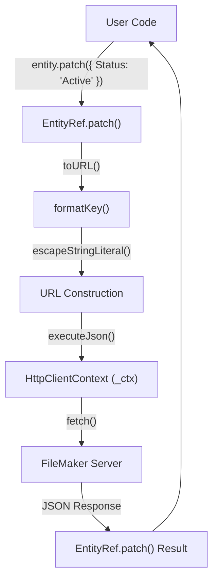
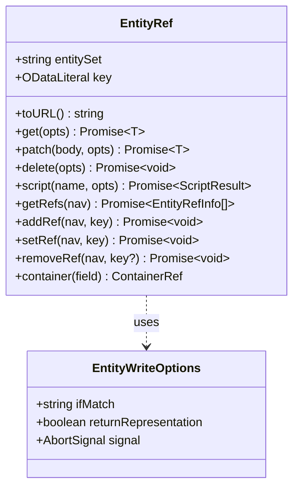

# EntityRef — Single-Record Operations

The `EntityRef<T>` class provides a handle for performing operations on a specific FileMaker record identified by its primary key. It is typically instantiated via the `Query.byKey(key)` method [src/entity.ts:2-5]().

## Overview

`EntityRef` encapsulates the logic for targeting a single entity within an OData entity set. It constructs URLs in the format `<baseUrl>/<EntitySet>(<key>)` and provides methods for standard CRUD operations (`GET`, `PATCH`, `DELETE`) as well as record-scoped FileMaker script execution [src/entity.ts:49-52]().

### Data Flow: Single-Record Request

The following diagram illustrates how an `EntityRef` translates a method call into an HTTP request against the FileMaker OData API.

**EntityRef Request Pipeline**



Sources: [src/entity.ts:85-103](), [src/entity.ts:66-68](), [src/entity.ts:36-46]()

---

## The EntityRef Class

The class is generic, where `T` represents the shape of the record (defaulting to `Record<string, unknown>`) [src/entity.ts:53]().

### Key Members

| Member | Type | Description |
| :--- | :--- | :--- |
| `entitySet` | `string` | The name of the FileMaker table/layout [src/entity.ts:54](). |
| `key` | `ODataLiteral` | The primary key value (string, number, or boolean) [src/entity.ts:55](). |
| `toURL()` | `() => string` | Generates the absolute OData URL for the record [src/entity.ts:66-68](). |

Sources: [src/entity.ts:53-68]()

---

## Operations

### GET (Read)

The `get()` method fetches the full record. It returns a promise resolving to the parsed JSON row [src/entity.ts:71-78]().

* **Implementation**: Calls `executeJson` with the `GET` method [src/entity.ts:72]().

### PATCH (Update)

The `patch()` method performs a partial update on the record [src/entity.ts:85-103]().

* **Optimistic Concurrency**: If `opts.ifMatch` is provided (typically an ETag from a previous `GET`), it is sent in the `If-Match` header [src/entity.ts:93]().
* **Return Representation**: By default, FileMaker Server returns `204 No Content`. Setting `returnRepresentation: true` sends the `Prefer: return=representation` header, forcing the server to return the updated record [src/entity.ts:91]().

### DELETE

The `delete()` method removes the record [src/entity.ts:106-116]().

* **Implementation**: Uses `executeRequest` with `accept: 'none'` because successful deletions return no body [src/entity.ts:110-113]().

### Script Execution

The `script()` method invokes a FileMaker script within the context of the specific record [src/entity.ts:122-124]().

* **Context**: FileMaker Server automatically sets the "current record" to this entity before the script begins execution [src/entity.ts:119-121]().
* **Implementation**: Delegates to `runScriptAtEntity` in the scripts module [src/entity.ts:123]().

### Navigation Properties (`$ref`) (v0.2.0)

The `EntityRef` class provides full `$ref` CRUD for OData relationship links:

* **`getRefs(navProperty)`**: Lists related entity references (GET `.../<navProperty>/$ref`).
* **`addRef(navProperty, relatedKey)`**: Adds a reference to a collection-valued navigation property (POST).
* **`setRef(navProperty, relatedKey)`**: Sets a reference for a single-valued navigation property (PATCH).
* **`removeRef(navProperty, relatedKey?)`**: Removes a reference (DELETE). Omit `relatedKey` to clear a single-valued property.

```typescript
// List related references
const refs = await db.from('contact').byKey(7).getRefs('addresses')
// Add a reference
await db.from('contact').byKey(7).addRef('addresses', 42)
// Set a reference (single-valued)
await db.from('order').byKey(100).setRef('customer', 7)
// Remove a reference
await db.from('contact').byKey(7).removeRef('addresses', 42)
await db.from('order').byKey(100).removeRef('customer') // clears single-valued
```

Sources: [src/entity.ts:126-175](), [README.md:320-338]()

### Container Fields (M4)

The `container(fieldName)` method returns a `ContainerRef` for binary I/O on FileMaker container fields. Supports `Blob`, `ArrayBuffer`, and `Uint8Array` for uploads, with MIME sniffing and filename extraction.

Sources: [src/entity.ts:177-180](), [src/containers.ts]()

---

## Internal Helpers

### Key Formatting

The `formatKey()` function ensures that primary keys are correctly serialized into the URL path segment [src/entity.ts:36-46]().

**Key Serialization Logic**

| Type | Transformation | Example |
| :--- | :--- | :--- |
| `string` | Wrapped in single quotes; internal quotes escaped | `ID001` → `'ID001'` |
| `number` | Converted to string (must be finite) | `123` → `123` |
| `boolean` | Converted to `true` or `false` | `true` → `true` |

Sources: [src/entity.ts:36-46]()

### Configuration Objects

#### EntityWriteOptions

Extends `RequestOptions` to support FileMaker-specific write behaviors [src/entity.ts:18-30]().

* `ifMatch?: string`: Used for ETag-based optimistic concurrency [src/entity.ts:23]().
* `returnRepresentation?: boolean`: Controls whether the server returns the modified data [src/entity.ts:29]().

**Code Entity Mapping**



Sources: [src/entity.ts:53-180](), [src/entity.ts:18-30](), [src/containers.ts]()
