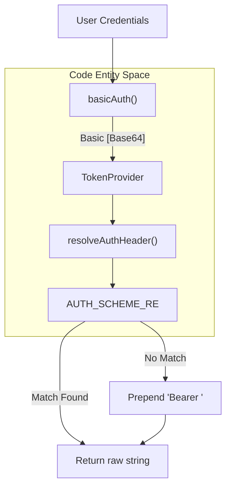
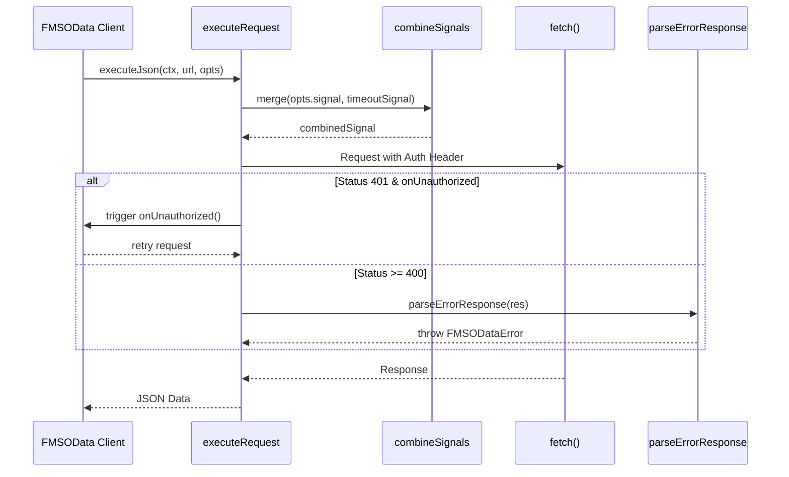

# HTTP Layer

The HTTP Layer, defined in `src/http.ts`, provides the low-level plumbing for all network communication between the library and FileMaker Server. It centralizes authentication logic, signal management for timeouts and cancellations, and a resilient request pipeline that handles 401 retries and error normalization.

## Authentication Handling

The library supports **Basic** (Username/Password) and **Bearer** (Token-based / OAuth / FileMaker Cloud) authentication. Because FileMaker Server's OData implementation primarily relies on HTTP Basic auth, the layer provides helpers to ensure correct encoding and scheme detection.

### resolveAuthHeader

The `resolveAuthHeader` function takes a `TokenProvider` (which can be a static string or an async function) and ensures it is prefixed with a valid HTTP authentication scheme [src/http.ts:19-28](). If a string is provided without a scheme, it defaults to `Bearer` [src/http.ts:27-27]().

### basicAuth

The `basicAuth` helper facilitates the creation of credentials for FileMaker accounts. It encodes the `user:password` string into Base64, automatically selecting the appropriate environment implementation: `Buffer` for Node.js or `btoa` for browsers and FileMaker Web Viewers [src/http.ts:31-39]().

### bearerAuth (v0.4.0)

The `bearerAuth` helper builds a `Bearer <token>` authorization header for OAuth / FileMaker Cloud authentication [src/http.ts:24-26](). Note: the previous `fmidAuth()` helper (which produced `FMID <token>`) was removed in v0.4.0 as the spec now uses the standard `Bearer` scheme.

```typescript
import { bearerAuth } from 'fms-odata-js'
const token = bearerAuth(oauthToken) // 'Bearer <token>'
```

### Authentication Flow

The following diagram illustrates how authentication is resolved during a request cycle.

**Diagram: Authentication Resolution Logic**



Sources: [src/http.ts:16-39]()

---

## Request Execution Pipeline

The core of the HTTP layer is `executeRequest`, which manages the lifecycle of a single fetch operation. It is wrapped by `executeJson` for standard OData interactions.

### executeRequest Implementation

This function performs several critical tasks:

1.  **Header Merging**: Merges user-provided headers with mandatory `Authorization` and `Accept` headers [src/http.ts:107-111]().
2.  **Timeout Management**: Creates a `setTimeout` based on the `HttpClientContext.timeoutMs` and integrates it into the request's `AbortSignal` [src/http.ts:113-117]().
3.  **Signal Composition**: Uses `combineSignals` to merge the user's manual `AbortSignal` with the internal timeout signal [src/http.ts:119-119]().
4.  **401 Retry**: If a request fails with a 401 Unauthorized status, and an `onUnauthorized` callback is provided, the library will attempt to refresh the token/credentials once before failing [src/http.ts:136-139]().
5.  **Error Normalization**: If the response is not `ok`, it passes the response to `parseErrorResponse` to generate a structured `FMSODataError` [src/http.ts:141-143]().

### executeJson Convenience

The `executeJson` function wraps the execution pipeline to handle common JSON response patterns, including:

*   Returning `undefined` for `204 No Content` [src/http.ts:154-154]().
*   Resilient parsing for FileMaker Server responses that may omit the `content-type: application/json` header despite returning a JSON body [src/http.ts:155-170]().

**Diagram: Request Execution Data Flow**



Sources: [src/http.ts:92-171](), [src/http.ts:42-61]()

---

## Signal and Timeout Handling

The library provides a utility to merge multiple `AbortSignal` objects, allowing the system to respond to both user-initiated cancellations and internal timeouts simultaneously.

### combineSignals

The `combineSignals` function handles three scenarios [src/http.ts:42-61]():

*   **Zero/One Signal**: Returns `undefined` or the single signal directly to avoid overhead [src/http.ts:46-47]().
*   **Pre-aborted Signals**: If any input signal is already aborted, the combined signal is returned in an aborted state immediately [src/http.ts:50-53]().
*   **Active Monitoring**: Adds event listeners to all provided signals. When any one signal aborts, the `AbortController` triggers the combined signal [src/http.ts:54-59]().

| Function | Role |
| :--- | :--- |
| `executeRequest` | Main entry point for the HTTP pipeline. |
| `executeJson` | Specialized wrapper for OData JSON payloads. |
| `combineSignals` | Merges `AbortSignal` instances for timeouts and cancellation. |
| `resolveAuthHeader` | Ensures correct `Basic` or `Bearer` formatting. |

Sources: [src/http.ts:24-26](), [src/http.ts:42-61](), [src/http.ts:72-78]()

---

## Internal Context and Options

The HTTP layer relies on the `HttpClientContext` which is typically managed by the `FMSOData` client and passed down to every request.

### HttpClientContext

This interface defines the environment for the request [src/http.ts:73-78]():

*   `token`: The `TokenProvider` used for auth resolution.
*   `fetch`: The fetch implementation (allows for `insecure-fetch` in local dev).
*   `timeoutMs`: Global timeout setting.
*   `onUnauthorized`: Hook for refreshing credentials.

### HttpRequestOptions

Extends the standard `RequestOptions` to include OData-specific controls like the `accept` property, which maps to standard MIME types (e.g., `'json'` maps to `application/json`) [src/http.ts:64-70](), [src/http.ts:80-86]().

Sources: [src/http.ts:63-86]()
