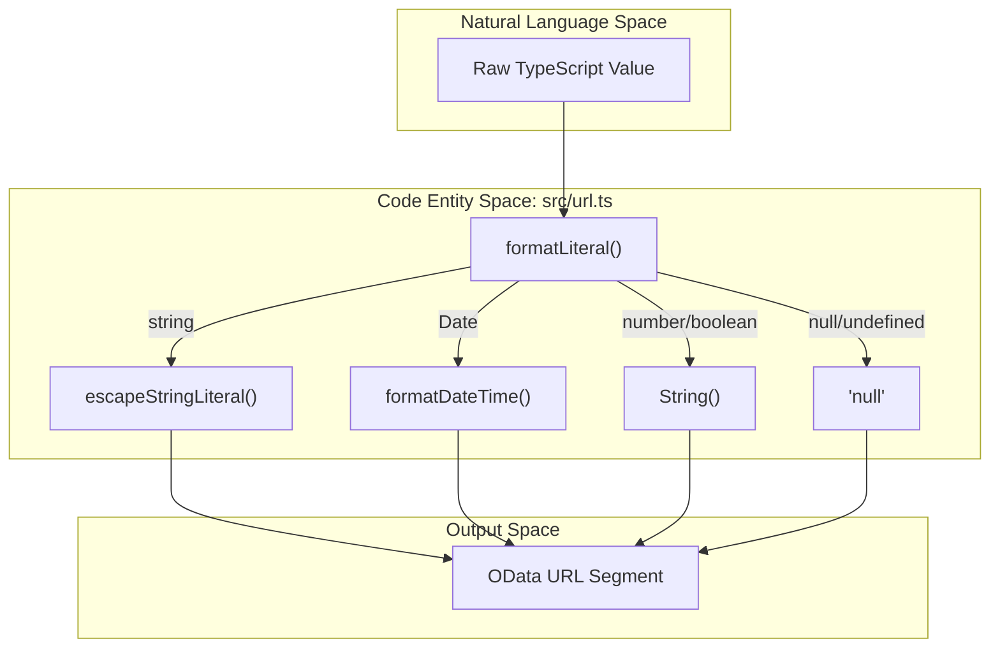
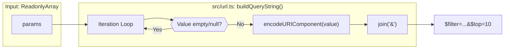

# URL Utilities

The `src/url.ts` module provides specialized functions for encoding and formatting data into OData-compliant URL components. These utilities handle the specific syntax requirements of OData literals, path segments, and query strings, while accounting for FileMaker Server's specific requirements regarding date formatting and percent-encoding [src/url.ts:1-9]().

## OData Literal Handling

The library defines `ODataLiteral` as the set of primitive types that can appear on the right-hand side of an OData `$filter` comparison or within an entity key [src/url.ts:11-12]().

### `ODataLiteral` Type Definition

| Type | Description |
| :--- | :--- |
| `string` | Single-quoted and escaped. |
| `number` | Serialized as finite numeric strings. |
| `boolean` | `true` or `false` keywords. |
| `Date` | UTC ISO-8601 strings (no milliseconds). |
| `null` / `undefined` | Serialized as the `null` keyword. |

Sources: [src/url.ts:11-12](), [src/url.ts:37-49]()

### String Escaping

The `escapeStringLiteral()` function prepares strings for inclusion in OData filters by doubling single quotes (`'`) to prevent injection or syntax errors [src/url.ts:15-17](). The `formatLiteral()` function then wraps these escaped strings in single quotes [src/url.ts:39-39]().

### Literal Formatting Flow

The following diagram illustrates how the `formatLiteral` function dispatches various TypeScript types to their OData-compliant string representations.

**Data Transformation: TypeScript to OData Literal**

Sources: [src/url.ts:15-17](), [src/url.ts:37-49]()

---

## Date and Time Serialization

FileMaker Server OData implementation requires a specific flavor of ISO-8601. While standard OData often accepts milliseconds, FileMaker requires UTC timestamps without millisecond precision [src/url.ts:4-5]().

*   **`formatDateTime(d: Date)`**: Converts a JavaScript `Date` object to a string like `2026-04-17T14:45:00Z`. It uses `toISOString()` and applies a regex `/\.\d{3}Z$/` to strip milliseconds [src/url.ts:20-25]().
*   **`parseDateTime(s: string)`**: A robust parser that converts OData `DateTimeOffset` strings back into JavaScript `Date` objects, supporting strings both with and without milliseconds [src/url.ts:28-34]().

Sources: [src/url.ts:19-34]()

---

## URL Construction Helpers

The module provides two primary helpers for building the structural components of a URL: path segments and query parameters.

### `encodePathSegment(s: string)`

Wraps `encodeURIComponent` to ensure that entity set names or keys containing special characters (like spaces) are correctly escaped (e.g., spaces become `%20`) [src/url.ts:52-54]().

### `buildQueryString(params)`

Constructs a full query string from an array of key-value pairs.

*   **Keys**: Emitted verbatim, as they are typically internal OData system variables like `$filter` or `$top` [src/url.ts:59-60]().
*   **Values**: Percent-encoded using `encodeURIComponent`. This ensures that spaces in filters are encoded as `%20` rather than `+`, which is a strict requirement for OData `$filter` values [src/url.ts:7-8]().
*   **Filtering**: Any pairs with `null`, `undefined`, or empty string values are automatically omitted from the resulting string [src/url.ts:66-68]().

**Query String Construction Logic**

Sources: [src/url.ts:63-70]()

---

## Summary of Functions

| Function | Input | Output | Purpose |
| :--- | :--- | :--- | :--- |
| `escapeStringLiteral` | `string` | `string` | Doubles single quotes [src/url.ts:15-17](). |
| `formatDateTime` | `Date` | `string` | ISO-8601 without ms [src/url.ts:20-25](). |
| `parseDateTime` | `string` | `Date` | Converts OData string to Date [src/url.ts:28-34](). |
| `formatLiteral` | `ODataLiteral` | `string` | Formats any type for `$filter` [src/url.ts:37-49](). |
| `encodePathSegment` | `string` | `string` | Percent-encodes path parts [src/url.ts:52-54](). |
| `buildQueryString` | `[key, val][]` | `string` | Serializes query parameters [src/url.ts:63-70](). |

Sources: [src/url.ts:1-70]()
