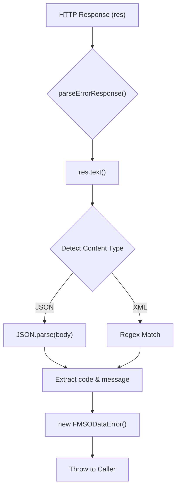
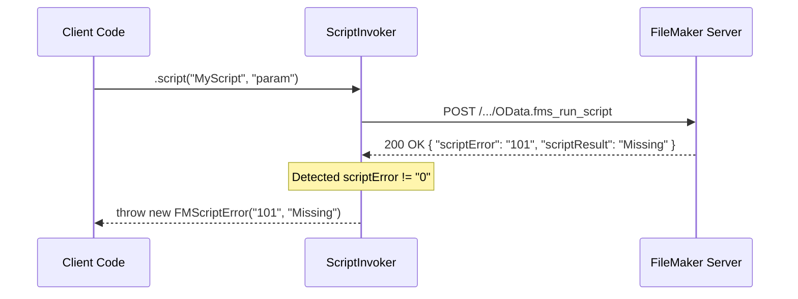

# Error Handling

The `fms-odata-js` library employs a structured error hierarchy to provide granular feedback on both transport-level failures and FileMaker-specific logic errors. By normalizing responses from FileMaker Server—which can inconsistently return JSON or XML error envelopes—the library ensures that developers can handle exceptions predictably across different operation types.

## Error Hierarchy

The library defines a base class for all OData-related failures and a specialized subclass for script execution failures.

### FMSODataError

The `FMSODataError` is the base class for all errors thrown during HTTP operations [src/errors.ts:4-26](). It captures the essential context of the failed request, including the HTTP status and the raw error payload.

| Property | Type | Description |
| :--- | :--- | :--- |
| `status` | `number` | The HTTP status code (e.g., 401, 404, 500). |
| `code` | `string \| undefined` | The specific error code returned by FileMaker (e.g., "101"). |
| `odataError` | `unknown` | The raw parsed body of the error response. |
| `request` | `object \| undefined` | Contains the `url` and `method` of the failing request. |

### FMScriptError

The `FMScriptError` is a specialized subclass of `FMSODataError` [src/errors.ts:85-111](). It is thrown when an OData Action (script execution) completes with a non-zero FileMaker script error.

Unlike standard errors, an `FMScriptError` represents a successful HTTP transaction (usually a `200 OK` or `201 Created`) where the internal FileMaker script logic failed [src/errors.ts:78-80]().

| Property | Type | Description |
| :--- | :--- | :--- |
| `scriptError` | `string` | The FileMaker script error code (e.g., "104" for script missing). |
| `scriptResult` | `string \| undefined` | The string value returned by the FileMaker `Exit Script` step. |

### Error Class Relationship

The following diagram illustrates the relationship between the error classes and the data they encapsulate.

**Error Entity Mapping**

```mermaid
classDiagram
    class Error {
        <<Built-in>>
        +message: string
        +stack: string
    }
    class FMSODataError {
        +status: number
        +code: string
        +odataError: unknown
        +request: RequestInfo
    }
    class FMScriptError {
        +scriptError: string
        +scriptResult: string
    }

    Error <|-- FMSODataError
    FMSODataError <|-- FMScriptError

    style FMSODataError stroke-width:2px
    style FMScriptError stroke-width:2px
```

Sources: [src/errors.ts:4-26](), [src/errors.ts:85-111]()

---

## Response Parsing Logic

FileMaker Server's OData implementation may return errors in different formats depending on the nature of the failure. The `parseErrorResponse()` function is an internal utility that normalizes these disparate formats into a single `FMSODataError` instance [src/errors.ts:35-75]().

### Format Detection

The parser inspects the `Content-Type` header and the body content to determine the parsing strategy [src/errors.ts:51-53]():

1.  **JSON Envelope**: Standard OData error format: `{ "error": { "code": "...", "message": "..." } }` [src/errors.ts:55-66]().
2.  **XML Envelope**: FileMaker's legacy error format: `<m:error><m:code>...</m:code><m:message>...</m:message></m:error>` [src/errors.ts:67-72]().

### Logic Flow of parseErrorResponse

The following diagram tracks the flow of a failing response through the normalization logic.

**Normalization Pipeline**



Sources: [src/errors.ts:35-75]()

---

## Script Error Promotion

Script execution requires specific handling because FileMaker returns the script status inside a successful JSON response envelope. The library promotes these internal errors to `FMScriptError` to allow developers to use standard `try/catch` blocks for script logic failures.

### Script Execution Flow

The `ScriptInvoker` (used by `db.script()`, `query.script()`, etc.) performs the following steps:

1.  Executes the HTTP POST request.
2.  Parses the JSON response.
3.  Checks the `scriptError` field.
4.  If `scriptError !== "0"`, it constructs and throws an `FMScriptError`.

**Script Error Promotion Sequence**



Sources: [src/errors.ts:78-84](), [src/errors.ts:85-111]()

## Implementation Summary

| Function/Class | Role | Source |
| :--- | :--- | :--- |
| `FMSODataError` | Base class for HTTP errors and data validation failures. | [src/errors.ts:4-26]() |
| `FMScriptError` | Subclass for non-zero FileMaker script return codes. | [src/errors.ts:85-111]() |
| `parseErrorResponse()` | Normalizes JSON and XML error bodies from FMS. | [src/errors.ts:35-75]() |

Sources: [src/errors.ts:1-112]()
