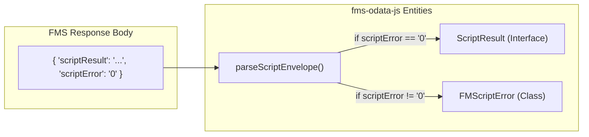

# Script Execution

FileMaker Server (FMS) exposes scripts via the OData v4 **Action** mechanism. This allows external applications to trigger business logic directly within the FileMaker engine. In `fms-odata-js`, script execution is integrated into the fluent API, allowing scripts to be called with specific context (database, table, or record).

All script invocations are performed via HTTP `POST` requests to a `Script.<ScriptName>` path suffix [src/scripts.ts:4-9]().

### Execution Flow Overview

The library handles the serialization of parameters, URL construction based on scope, and the normalization of the FileMaker response envelope.

#### Data Transformation Logic
The following diagram illustrates how a script call moves from the high-level API through the `ScriptInvoker` to the network.

**Diagram: Script Invocation Pipeline**
```mermaid
graph TD
  subgraph "Natural Language Space"
    A["'Run the 'Sync' script'"]
    B["'Pass 'JSON' as param'"]
  end

  subgraph "Code Entity Space"
    C["FMSOData.script()"]
    D["ScriptInvoker.run()"]
    E["executeJson()"]
    F["parseScriptEnvelope()"]
  end

  A --> C
  B --> C
  C --> D
  D -- "POST /Script.Sync" --> E
  E -- "Raw JSON Response" --> F
  F -- "Success: ScriptResult" --> G["Caller"]
  F -- "Error: FMScriptError" --> H["Catch Block"]
end
```
Sources: [src/scripts.ts:103-123](), [src/scripts.ts:131-160]()

---

### Scope Levels

FileMaker scripts can be executed at three distinct scope levels. The scope determines the "context" (Current Layout/Found Set/Record) when the script starts.

| Scope | API Entry Point | URL Pattern | Use Case |
| :--- | :--- | :--- | :--- |
| **Database** | `db.script()` | `/<db>/Script.<name>` | Global logic, maintenance, or complex multi-table imports. |
| **Entity-Set** | `query.script()` | `/<db>/<Set>/Script.<name>` | Logic scoped to a specific table or found set context. |
| **Record** | `entity.script()` | `/<db>/<Set>(<key>)/Script.<name>` | Logic acting on a specific primary key (e.g., "Send Invoice"). |

For details on how context is established in FileMaker, see [Script Scopes and FMScriptError](#3.2).

### FMSID Invocation (v26+)

On FileMaker Server 2026 (v26+) or later, scripts can also be invoked by their immutable FMSID instead of name. This is more robust because the ID survives script renames and database migrations.

```typescript
// Check if FMSID invocation is supported
if (await db.hasFeature('scriptsByFMSID')) {
  // Invoke by FMSID (immutable across renames)
  const result = await db.scriptById(42, { parameter: 'hello' })
  console.log(result.scriptResult, result.scriptError)
}
```

Sources: [src/client.ts:84-86](), [src/scripts.ts]()

---

### The Script Result Envelope

FileMaker Server returns a JSON envelope containing the script's exit status and result. The library parses this into a `ScriptResult` object.

*   **`scriptResult`**: The string value returned by the FileMaker `Exit Script [Text Result: ...]` step [src/scripts.ts:41-43]().
*   **`scriptError`**: The FileMaker error code (e.g., `0` for success). If this is non-zero, the library automatically throws an `FMScriptError` [src/scripts.ts:44-45]().
*   **`raw`**: The full parsed response body for forward compatibility [src/scripts.ts:46-47]().

**Diagram: Response Handling**

Sources: [src/scripts.ts:131-160](), [src/errors.ts:17-18]()

---

### API Summary

The script execution system is powered by the `ScriptInvoker` class, which manages URL construction and HTTP request dispatching.

*   **`ScriptOptions`**: Allows passing a `parameter` (mapped to `scriptParameter` in the JSON body) and an `AbortSignal` for cancellation [src/scripts.ts:27-34]().
*   **`ScriptInvoker`**: The internal engine that handles path encoding and response unwrapping [src/scripts.ts:76-123]().
*   **Convenience Helpers**: `runScriptAtDatabase`, `runScriptAtEntitySet`, and `runScriptAtEntity` provide simplified internal access for the client classes [src/scripts.ts:184-212]().

For a full list of methods and types, see [Script API Reference](#3.1).

Sources: [src/scripts.ts:76-85](), [src/scripts.ts:103-123]()
