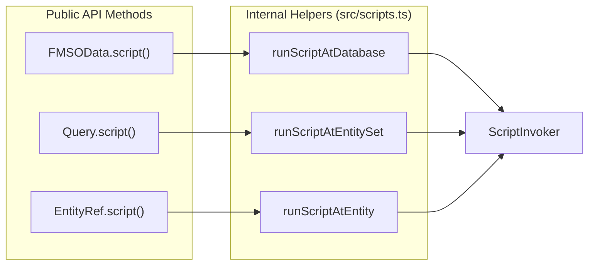

# Script API Reference

FileMaker Server (FMS) exposes FileMaker scripts through the OData v4 Action mechanism. This library provides a structured way to invoke these scripts at different context levels (database, entity-set, or specific record) using the `ScriptInvoker` class and associated helper functions.

## Overview of Script Invocation

Scripts are invoked via `POST` requests to specific URL patterns. The library abstracts the construction of these URLs and the handling of the response envelope.

### Script Scopes

The library supports three primary scopes for script execution, which determine the context (such as the "current record" or "current layout") in FileMaker:

| Scope | URL Pattern | Description |
| :--- | :--- | :--- |
| **Database** | `/<db>/Script.<name>` | Runs in a global context. [src/scripts.ts:7-7]() |
| **Entity-Set** | `/<db>/<EntitySet>/Script.<name>` | Runs in the context of a specific layout/table. [src/scripts.ts:8-8]() |
| **Record** | `/<db>/<EntitySet>(<key>)/Script.<name>` | Runs with a specific record as the current record. [src/scripts.ts:9-9]() |

Sources: [src/scripts.ts:1-14](), [dist/scripts.d.ts:1-14]()

---

## Core Data Structures

### ScriptOptions

The `ScriptOptions` interface defines the parameters for a script call.

```typescript
export interface ScriptOptions extends RequestOptions {
  parameter?: string // Optional script parameter
}
```

*   **parameter**: If provided, it is serialized into a JSON body as `{"scriptParameter": "<string>"}`. If omitted, the script runs with an empty parameter. [src/scripts.ts:27-34]()

### ScriptResult

The `ScriptResult` envelope contains the data returned by FileMaker.

```typescript
export interface ScriptResult {
  scriptResult?: string // Value from 'Exit Script [Text Result: ...]'
  scriptError: string   // Always "0" (success)
  raw: unknown          // Full parsed response body
}
```

*   **scriptError**: The library automatically promotes any non-zero `scriptError` to an `FMScriptError` exception. Therefore, a resolved `ScriptResult` always implies a successful execution (`"0"`). [src/scripts.ts:37-48]()

Sources: [src/scripts.ts:26-48](), [dist/scripts.d.ts:18-39]()

---

## ScriptInvoker Class

The `ScriptInvoker` is the low-level engine used to construct URLs and execute requests. It is used internally by `FMSOData.script()`, `Query.script()`, and `EntityRef.script()`.

### Implementation Details

The class stores the `_client` (an instance of `FMSOData`) and the `ScriptScope` (entity set and primary key). [src/scripts.ts:76-85]()

#### URL Generation

The `url(name: string)` method handles the logic for building the OData Action path:

1.  Encodes the script name using `encodePathSegment`. [src/scripts.ts:91-91]()
2.  Appends the segment to the `baseUrl`.
3.  If a `key` is present, it formats it using `formatKey` (handling strings, numbers, and booleans) and wraps it in parentheses. [src/scripts.ts:51-61](), [src/scripts.ts:99-99]()

#### Execution Flow

The `run(name: string, opts: ScriptOptions)` method performs the following:

1.  Generates the target URL.
2.  Sets the `Content-Type: application/json` header if a parameter is provided. [src/scripts.ts:108-108]()
3.  Calls `executeJson` with the `POST` method. [src/scripts.ts:113-119]()
4.  Passes the raw JSON result to `parseScriptEnvelope`. [src/scripts.ts:121-121]()

### Script Invocation Logic

The following diagram bridges the high-level `ScriptInvoker` logic to the internal HTTP execution.

**Diagram: Script Invocation Data Flow**

```mermaid
graph TD
  subgraph "ScriptInvoker Entity"
    A["ScriptInvoker.run(name, opts)"] --> B["ScriptInvoker.url(name)"]
    B --> C["executeJson()"]
  end

  subgraph "Internal Processing"
    C --> D["parseScriptEnvelope()"]
    D --> E["extractEnvelope()"]
    E --> F{scriptError == "0"?}
    F -- "Yes" --> G["Return ScriptResult"]
    F -- "No" --> H["throw FMScriptError"]
  end

  subgraph "URL Construction"
    B -.-> I["encodePathSegment()"]
    B -.-> J["formatKey()"]
  end
```

Sources: [src/scripts.ts:76-123](), [src/scripts.ts:131-160]()

---

## Envelope Parsing and Extraction

FileMaker Server may return the script result envelope in different shapes depending on the version or context (sometimes nested under a top-level key). The library uses `extractEnvelope` to normalize this.

### `extractEnvelope(raw: unknown)`

This function scans the response object:

1.  Checks if `scriptError` or `scriptResult` exist at the root level. [src/scripts.ts:168-170]()
2.  If not found, it iterates through the values of the root object to find a nested object containing those keys. [src/scripts.ts:172-179]()

### `parseScriptEnvelope(raw: unknown, request: ...)`

This internal helper:

1.  Extracts the envelope fields. [src/scripts.ts:137-137]()
2.  Normalizes `scriptError` to a string. [src/scripts.ts:139-140]()
3.  If `scriptError` is not `"0"`, it constructs and throws an `FMScriptError`, attaching the original `raw` response as `odataError`. [src/scripts.ts:144-155]()

Sources: [src/scripts.ts:131-181]()

---

## Convenience Helpers

The library provides internal functional helpers to streamline script execution across different parts of the API. These are utilized by the `FMSOData` client and query builders.

| Function | Scope | Internal Call |
| :--- | :--- | :--- |
| `runScriptAtDatabase` | Database | `new ScriptInvoker(client).run(...)` |
| `runScriptAtEntitySet` | Entity-Set | `new ScriptInvoker(client, { entitySet }).run(...)` |
| `runScriptAtEntity` | Record | `new ScriptInvoker(client, { entitySet, key }).run(...)` |

**Diagram: Convenience Helper Mapping**



Sources: [src/scripts.ts:184-213](), [dist/scripts.d.ts:72-77]()
