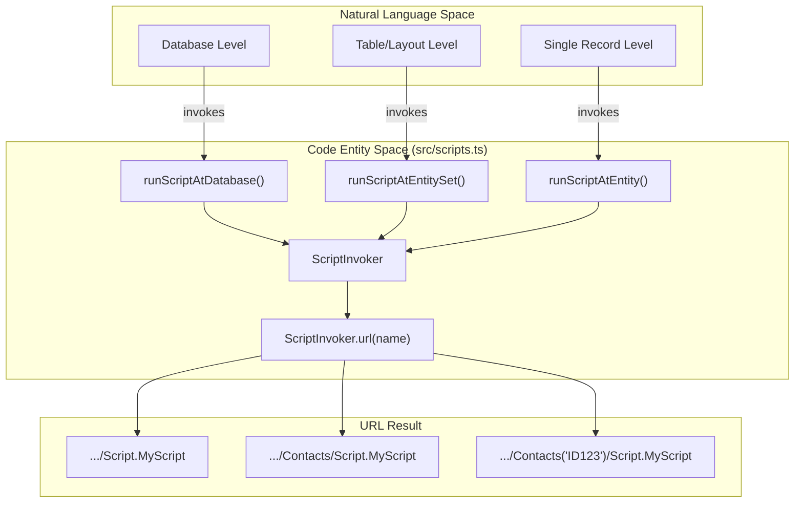
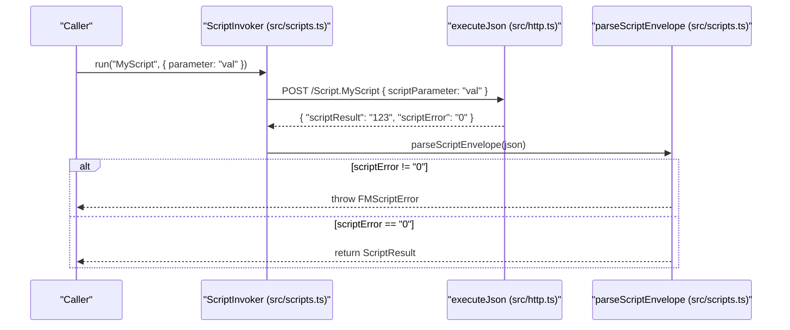

# Script Scopes and FMScriptError

FileMaker Server (FMS) exposes scripts as OData Actions. This library provides three distinct levels of script invocation, each mapping to a specific URL pattern that determines the script's execution context (the "current record" or "found set" context) within FileMaker.

## Script Scopes

The `fms-odata-js` library allows you to trigger scripts from three different entry points. The choice of entry point determines the path suffix used in the `POST` request and how FileMaker Server initializes the script's environment [src/scripts.ts:4-9]().

### 1. Database Scope (`db.script()`)

*   **URL Pattern:** `POST /<db>/Script.<name>` [src/scripts.ts:7]()
*   **Usage:** Use this for utility scripts that do not depend on a specific layout or record context.
*   **Context:** The script runs in the database context but without a specific layout or record active.

### 2. Entity-Set Scope (`Query#script()`)

*   **URL Pattern:** `POST /<db>/<EntitySet>/Script.<name>` [src/scripts.ts:8]()
*   **Usage:** Use this when the script needs to target a specific table (EntitySet).
*   **Context:** FileMaker Server sets the context to the layout associated with the EntitySet.

### 3. Record Scope (`EntityRef#script()`)

*   **URL Pattern:** `POST /<db>/<EntitySet>(<key>)/Script.<name>` [src/scripts.ts:9]()
*   **Usage:** Use this when the script must act upon a specific record.
*   **Context:** FMS makes the record identified by `<key>` the **current record**. This is equivalent to performing a "Go to Related Record" or a find for that specific ID before running the script.

### Mapping Natural Language to Code Entities

The following diagram illustrates how the conceptual "Scope" of a script maps to specific classes and URL generators in the codebase.

**Script Invocation Mapping**

**Sources:** [src/scripts.ts:71-100](), [src/scripts.ts:183-211]()

---

## The FMScriptError Promotion

In standard OData, a `200 OK` response indicates total success. However, FileMaker scripts can "fail" logically (e.g., a validation error or a `Go to Record` failing) while the HTTP request itself succeeds.

The library monitors the `scriptError` field in the response envelope [src/scripts.ts:139-140](). If this value is anything other than `"0"`, the library throws an `FMScriptError` [src/scripts.ts:144-155]().

### Error Hierarchy

`FMScriptError` extends `FMSODataError`, ensuring that generic error handling catches script failures while allowing specific logic for FileMaker error codes [src/errors.ts:85-111]().

| Field | Type | Description |
| :--- | :--- | :--- |
| `scriptError` | `string` | The FileMaker error code (e.g., `"101"` for Record Missing) [src/errors.ts:87](). |
| `scriptResult` | `string \| undefined` | The string returned by the `Exit Script` step [src/errors.ts:89](). |
| `status` | `number` | Usually `200`, as the HTTP request succeeded [src/errors.ts:148](). |

**Sources:** [src/errors.ts:85-111](), [src/scripts.ts:126-160]()

---

## Data Flow and Envelope Parsing

When a script is executed via `ScriptInvoker.run()`, the library performs the following steps:

1.  **Serialization:** If a `parameter` is provided, it is wrapped in a JSON object: `{"scriptParameter": "..."}` [src/scripts.ts:107-110]().
2.  **Execution:** The `executeJson` utility performs the `POST` request [src/scripts.ts:113-119]().
3.  **Envelope Extraction:** `extractEnvelope` searches for `scriptError` and `scriptResult` at the root or one level deep to handle different FMS version quirks [src/scripts.ts:162-181]().
4.  **Normalization:** `parseScriptEnvelope` coerces results to strings and checks for non-zero error codes [src/scripts.ts:131-160]().

**Script Execution Pipeline**

**Sources:** [src/scripts.ts:103-123](), [src/scripts.ts:131-160]()

---

## FileMaker Quirks

### Result Typing

A significant quirk of the FileMaker OData implementation is that `scriptResult` is **always a string** [docs/filemaker-quirks.md:45-51]().

*   If your script returns `Exit Script [ Text Result: 100 ]` (a number), the OData response will contain `"100"` (a string) [docs/filemaker-quirks.md:50-51]().
*   Booleans are returned as `"1"` or `"0"` [docs/filemaker-quirks.md:51]().

The library reflects this by typing `ScriptResult.scriptResult` as `string | undefined` [src/scripts.ts:43](). Callers must manually parse the result if a different type is expected [docs/filemaker-quirks.md:53-59]().

### Error Code Typing

Similarly, `scriptError` is returned as a string by the server (e.g., `"0"`, `"101"`). The library preserves this string format in both `ScriptResult` and `FMScriptError` to ensure strict equality checks (like `err.scriptError === '104'`) are reliable [docs/filemaker-quirks.md:61-64]().

**Sources:** [docs/filemaker-quirks.md:45-65](), [src/scripts.ts:41-48]()
