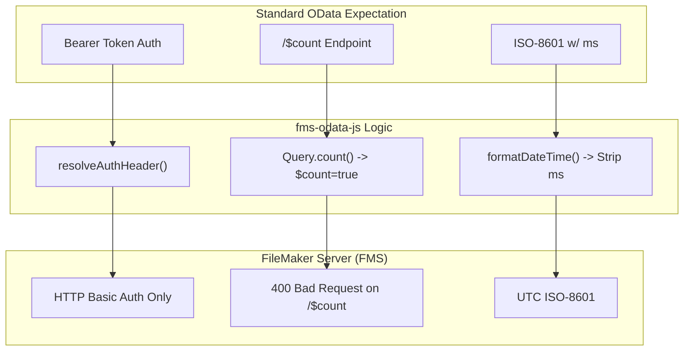
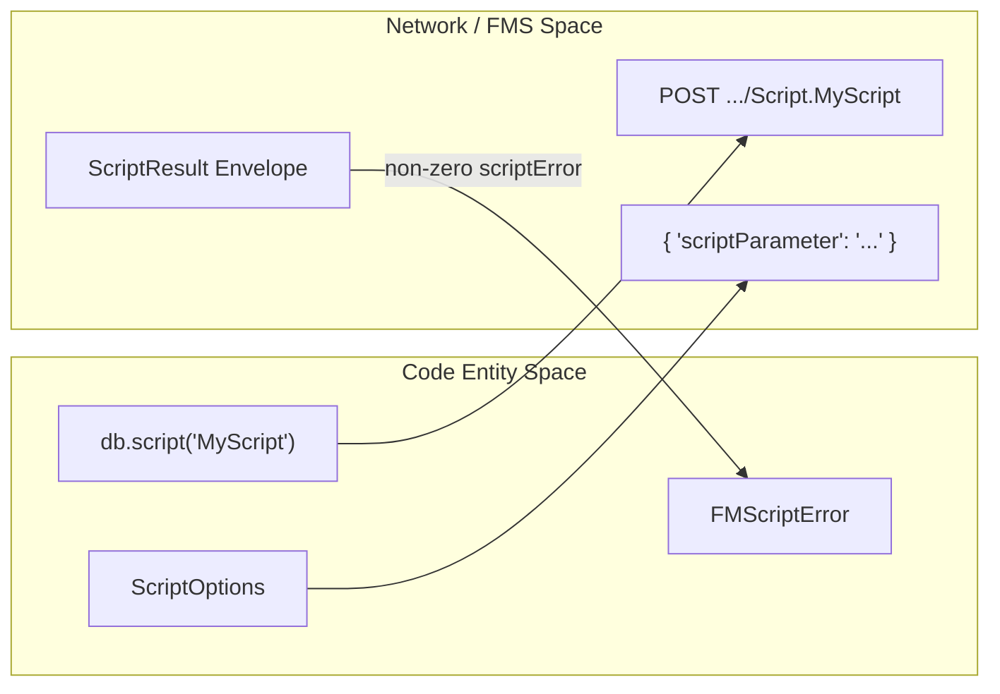

# FileMaker Server Quirks

This page serves as a comprehensive reference for the deviations FileMaker Server (FMS) exhibits from the standard OData v4 specification. While FMS provides a powerful OData interface, certain behaviors—ranging from authentication protocols to endpoint availability—require specific handling. The `fms-odata-js` library is designed to abstract these "sharp corners" away, providing a standard OData experience for developers.

## Overview of FMS Deviations

The following diagram illustrates how the library bridges the gap between standard OData expectations and FMS-specific requirements.

**FMS Quirk Mitigation Flow**

Sources: [docs/filemaker-quirks.md:1-45](), [src/url.ts:18-30]()

---

## Authentication Quirks

Unlike the FileMaker Data API, which uses a session-based Bearer token flow, the OData endpoint on FMS requires **HTTP Basic Authentication** for every request [docs/filemaker-quirks.md:7-13](). Providing a Data API session token will result in a `401 Unauthorized` response with FileMaker error `212` [docs/filemaker-quirks.md:12-13]().

The library handles this via:

- **`basicAuth()`**: A helper utility to generate the correctly formatted `Basic` string [src/http.ts:44-46]().
- **`resolveAuthHeader()`**: Logic that detects if the provided token already includes a scheme (like `Basic` or `Bearer`) and applies it, or defaults to `Bearer` for standard OData providers [src/http.ts:33-42]().
- **401-Retry**: If a request fails with a 401, the `HttpClient` can attempt a single retry if an `onUnauthorized` hook is provided in `FMSODataOptions` [src/http.ts:108-115]().

For details, see [Authentication Quirks](#4.1).

**Sources:** [src/http.ts:33-46](), [docs/filemaker-quirks.md:15-18]()

---

## Count, Date, and TLS Quirks

### The $count Endpoint

FMS does not support the OData path suffix `/$count` (e.g., `/contact/$count`), which typically returns a raw integer [docs/filemaker-quirks.md:20-23](). Instead, FMS returns a `400 Bad Request`.

- **Workaround**: The library's `Query` builder uses the inline query parameter `?$count=true` and extracts the value from the `@odata.count` property in the JSON response [docs/filemaker-quirks.md:25-27]().

### Date Formatting

FMS returns date-time values as UTC ISO-8601 strings. While it may return milliseconds, it often fails to parse them correctly when sent back in a `$filter` predicate [docs/filemaker-quirks.md:39-43]().

- **Workaround**: `formatDateTime()` strips millisecond precision to ensure compatibility [src/url.ts:24-26]().

### Insecure TLS

During development or LAN deployments, FMS often uses self-signed certificates which Node.js rejects by default [docs/filemaker-quirks.md:29-32]().

- **Workaround**: Setting the environment variable `FM_ODATA_INSECURE_TLS=1` triggers a process-wide bypass for unauthorized TLS certificates in development scripts [scripts/env.mjs:20-25]().

For details, see [Count, Date, and TLS Quirks](#4.2).

**Sources:** [src/query.ts:145-150](), [src/url.ts:18-30](), [docs/filemaker-quirks.md:20-37]()

---

## Script Execution and Result Typing

FileMaker scripts invoked via OData Actions return results in a specific JSON envelope. A significant quirk is that the `scriptResult` is **always** returned as a string, regardless of the data type returned by the `Exit Script` step in FileMaker [docs/filemaker-quirks.md:45-51]().

**Script Invocation Mapping**

Sources: [src/scripts.ts:1-50](), [CHANGELOG.md:14-19]()

### Handling Script Results

- **Type Casting**: Because `scriptResult` is always `string | undefined`, callers must manually coerce values using `Number()` or `Boolean()` [docs/filemaker-quirks.md:53-59]().
- **Error Promotion**: If the `scriptError` field in the response is non-zero, the library promotes the response to an `FMScriptError` [src/scripts.ts:88-95](). Note that `scriptError` itself is also returned as a string (e.g., `"101"`) [docs/filemaker-quirks.md:61-64]().

**Sources:** [src/scripts.ts:80-100](), [docs/filemaker-quirks.md:45-65]()
