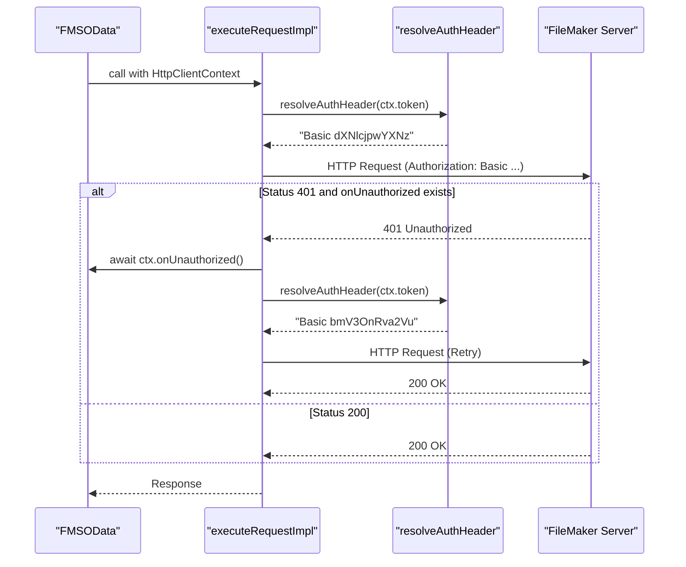
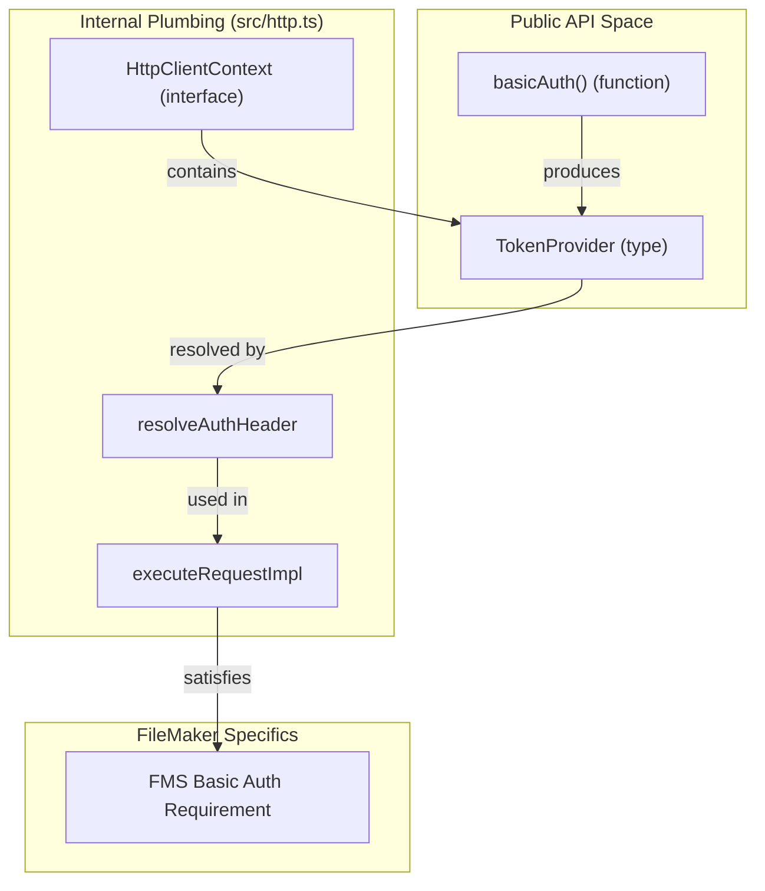

# Authentication Quirks

FileMaker Server (FMS) OData implementation diverges from other FileMaker APIs (like the Data API) regarding authentication protocols. While the Data API uses a session-based token exchange, the OData API requires credentials to be sent with every request using standard HTTP authentication schemes. This page details the library's mechanisms for handling these requirements, including auto-detection, helper utilities, and retry logic.

## The Basic Auth Requirement

Unlike the FileMaker Data API, which uses a `POST /fmi/data/vLatest/databases/<db>/sessions` call to exchange credentials for a bearer token, the FMS OData endpoint expects **HTTP Basic Authentication** [docs/filemaker-quirks.md:7-13](). Providing a Data API bearer token to the OData endpoint will result in a `401 Unauthorized` response with FileMaker error `212 (Invalid account/password)` [docs/filemaker-quirks.md:11-13]().

### Scheme Auto-Detection

The library uses `resolveAuthHeader` to determine how to format the `Authorization` header. It inspects the string provided by the `TokenProvider` (which can be a static string or an async function) [src/http.ts:18-28]().

1.  **Explicit Scheme**: If the string starts with a known scheme (Basic, Bearer, Negotiate, or Digest), it is used as-is [src/http.ts:15-16](), [src/http.ts:27-27]().
2.  **Implicit Bearer**: If no scheme is detected, the library defaults to prefixing the value with `Bearer` [src/http.ts:27-27]().

Because FMS requires Basic auth, developers must ensure the token is prefixed with `Basic`. The `basicAuth()` helper is provided to simplify this.

### `basicAuth()` Helper

The `basicAuth` function encodes a username and password into the correct Base64 format [src/http.ts:31-39](). It is designed to be environment-agnostic, using Node.js `Buffer` if available, or falling back to `btoa` for browser environments and FileMaker Web Viewers [src/http.ts:34-37]().

**Implementation Logic:**

- Concatenates `user:password`.
- Encodes the string to Base64.
- Prepends the `Basic` prefix.

Sources: [docs/filemaker-quirks.md:7-19](), [src/http.ts:15-39]()

## 401-Retry Flow

The library implements a single-retry mechanism to handle expired credentials or session refreshes. This is managed within the internal `executeRequestImpl` function [src/http.ts:100-145]().

### The `onUnauthorized` Callback

When instantiating the client, users can provide an `onUnauthorized` hook in the `HttpClientContext` [src/http.ts:73-78](). If a request returns a `401 Unauthorized` status:

1. The library checks if an `onUnauthorized` callback exists and if the request has already been retried [src/http.ts:136-136]().
2. If both conditions are met, it executes the callback (which might refresh a token or log a rotation) [src/http.ts:137-137]().
3. It then re-runs the request exactly once [src/http.ts:138-138]().

### Data Flow: Request Execution

The following diagram illustrates how authentication is resolved and how the retry logic is triggered.

**Authentication and Retry Sequence**

Sources: [src/http.ts:73-78](), [src/http.ts:100-145]()

## Entity Mapping: Auth Components

The library abstracts the complexities of HTTP headers into a few key entities. This map connects the high-level authentication concepts to the specific code symbols responsible for them.

**Code Entity Map: Authentication**

Sources: [src/http.ts:13-39](), [src/http.ts:73-78](), [src/http.ts:100-108]()

## Summary of Auth Workarounds

| Feature | FMS Behavior | Library Workaround |
| :--- | :--- | :--- |
| **Auth Scheme** | Requires `Basic` [docs/filemaker-quirks.md:9-13]() | `basicAuth()` helper and `resolveAuthHeader` auto-prefixing [src/http.ts:19-39]() |
| **Data API Tokens** | Not accepted [docs/filemaker-quirks.md:11-13]() | Documentation encourages using credentials directly [docs/filemaker-quirks.md:15-18]() |
| **Token Expiry** | Returns 401 [src/http.ts:136-136]() | `onUnauthorized` hook for single-retry logic [src/http.ts:136-139]() |
| **Environment** | `btoa` vs `Buffer` | Polyfilled logic in `basicAuth` for Web Viewer/Node compatibility [src/http.ts:34-37]() |

Sources: [docs/filemaker-quirks.md:7-19](), [src/http.ts:19-39](), [src/http.ts:136-139]()
