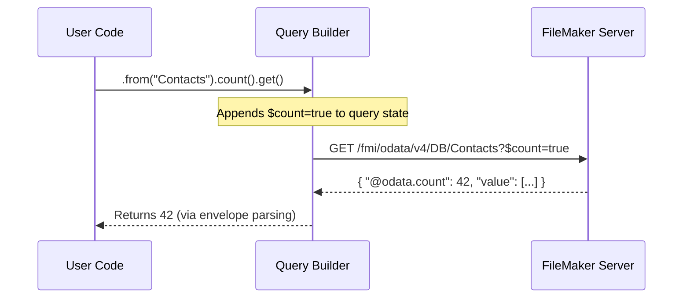
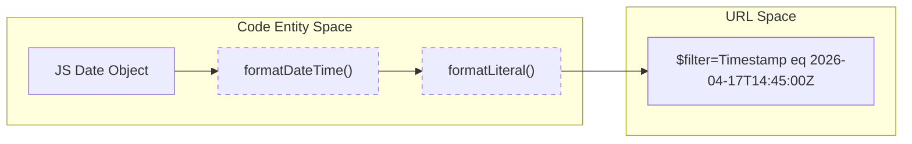
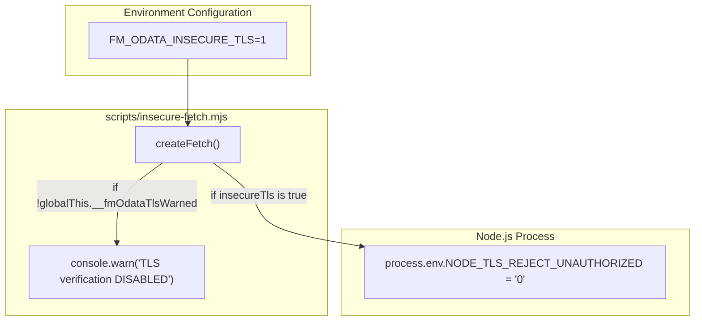

# Count, Date, and TLS Quirks

This page documents specific deviations from the OData v4 standard observed in FileMaker Server (FMS) and the internal workarounds implemented by `fms-odata-js` to ensure consistent behavior.

## Record Counting: Inline vs. Suffix

In standard OData v4, the total count of an entity set can be retrieved by appending `/$count` to the resource path. However, FileMaker Server does not implement this suffix-form endpoint [docs/filemaker-quirks.md:20-23]().

### The Quirk
Requesting `GET /fmi/odata/v4/<db>/<EntitySet>/$count` results in a `400 Bad Request` error [docs/filemaker-quirks.md:23-23]().

### The Workaround
The library transparently uses **inline counting**. When a user calls the `.count()` method on a query builder, the library appends the `$count=true` system query option to the URL [docs/filemaker-quirks.md:25-27](). To efficiently retrieve only the count without the full payload, it can be combined with `$top=0`.

| Feature | Standard OData | FileMaker Server | `fms-odata-js` Implementation |
| :--- | :--- | :--- | :--- |
| **Endpoint** | `/Table/$count` | Not Supported (400) | `GET /Table?$count=true` |
| **Response** | Plain text number | JSON Envelope | Extracts `@odata.count` from JSON |

**Implementation Flow: Count Retrieval**

Sources: [docs/filemaker-quirks.md:20-27]()

## Date and Time Formatting

FileMaker Server returns date-time values as UTC ISO-8601 strings. While it accepts various formats, it exhibits specific behavior regarding millisecond precision during round-trips.

### Millisecond Stripping
FMS has been observed returning timestamps both with and without milliseconds [docs/filemaker-quirks.md:41-42](). However, to ensure maximum compatibility and avoid issues where FMS might fail to match a record in a `$filter` due to unexpected precision, the library explicitly strips milliseconds when formatting `Date` objects for outgoing requests [docs/filemaker-quirks.md:42-43]().

### Implementation Details
The `formatDateTime` function in `src/url.ts` handles this transformation.

*   **Input**: JavaScript `Date` object.
*   **Process**: Converts to ISO string via `.toISOString()` and uses a regular expression `/\.\d{3}Z$/` to replace the millisecond component with a trailing `Z` [src/url.ts:20-25]().
*   **Result**: `2026-04-17T14:45:00.123Z` becomes `2026-04-17T14:45:00Z`.

**Data Flow: Date Serialization**

Sources: [src/url.ts:19-34](), [docs/filemaker-quirks.md:39-43]()

## Insecure TLS for LAN Deployments

FileMaker Server instances deployed on local area networks (LAN) often use self-signed SSL certificates or certificates issued to internal IP addresses (e.g., `https://192.168.0.24`) [docs/filemaker-quirks.md:29-30]().

### The Quirk
Modern Node.js environments (and the underlying `fetch` implementation) reject these certificates by default for security reasons, throwing a "self-signed certificate" error [docs/filemaker-quirks.md:30-32]().

### The Workaround: `FM_ODATA_INSECURE_TLS`
For development and testing environments, the library provides a mechanism to bypass TLS verification.

1.  **Environment Variable**: Setting `FM_ODATA_INSECURE_TLS=1` signals the library to allow unauthorized certificates [docs/filemaker-quirks.md:34-36]().
2.  **Process Logic**: The `createFetch` factory in `scripts/insecure-fetch.mjs` detects this setting and sets `process.env.NODE_TLS_REJECT_UNAUTHORIZED = '0'` for the current Node process [scripts/insecure-fetch.mjs:21-25]().
3.  **Warning**: The library logs a console warning to ensure developers are aware that security is degraded [scripts/insecure-fetch.mjs:26-31]().

**TLS Configuration Logic**

Sources: [scripts/insecure-fetch.mjs:1-34](), [docs/filemaker-quirks.md:29-37]()
