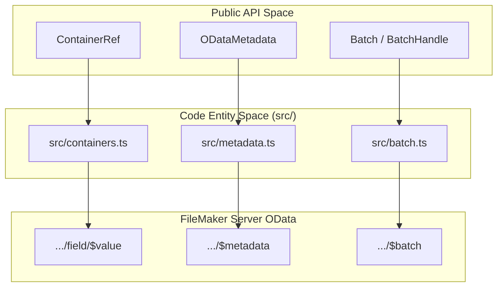
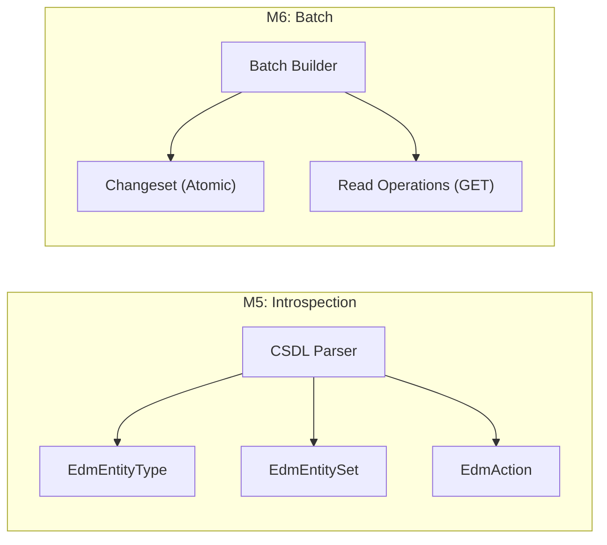

# Milestones & Release History

This page summarizes the completed milestones and release history for `fms-odata-js`.

## Release Summary

| Version | Features | Status |
| :--- | :--- | :--- |
| **v0.4.0** | DDL schema editing, webhook management, spec-ts 2.0.1 alignment, `bearerAuth` (replaces `fmidAuth`) | ✓ Released |
| **v0.3.0** | Spec-ts 2.0.0 alignment: drop FM19, OData 4.01, corrected version history | ✓ Released |
| **v0.2.0** | Spec alignment: version detection, `$apply`, FMSID scripts, `$ref`, Bearer auth, IIFE bundle | ✓ Released |
| **v0.1.6** | M4 containers, M5 metadata, M6 batch | ✓ Released |
| **v0.1.4** | M3 script execution | ✓ Released |
| **v0.1.1** | M1-M2 CRUD queries | ✓ Released |

Sources: [CHANGELOG.md:1-135](), [package.json:3-3]()

### Feature Architecture Mapping

The following diagram maps the public API components to their internal modules and the FileMaker Server OData endpoints they interact with.

**Implemented Entity Relationships**

---

## Containers (M4)

The M4 milestone delivered the `ContainerRef` class to manage binary I/O for FileMaker container fields. It supports downloading files as `Blob` or `ReadableStream`, uploading data via two FMS-documented wire formats, and clearing container content.

Key features delivered:

*   **Dual upload modes**: `binary` (PATCH to `…/<field>`) for images and PDFs; `base64` (PATCH to parent record with annotations) for arbitrary file types.
*   **MIME sniffing**: `contentType` is optional on upload — the library sniffs the type from magic bytes (PNG, JPEG, GIF, TIFF, PDF).
*   **Filename parsing**: Extracts filenames from `Content-Disposition` including RFC 5987 `filename*=UTF-8''…` form.
*   **Streaming**: `getStream()` returns the raw `ReadableStream` without buffering.

For the full API reference, see [Containers (M4)](05.1-containers-m4).

---

## Metadata (M5)

M5 delivered a lightweight regex-based XML parser for the `$metadata` EDMX/CSDL endpoint. The parser produces a typed `ODataMetadata` object with no external dependencies and a minimal bundle footprint.

Key features delivered:

*   `FMSOData#metadata(opts?)` — fetches and parses the schema; results cached by default.
*   `FMSOData#metadataXml(opts?)` — returns the raw XML string for debugging.
*   Parsed types: `ODataMetadata`, `EdmEntityType`, `EdmEntitySet`, `EdmProperty`, `EdmAction`.
*   `refresh: true` option to bypass the cache.

For the full API reference, see [Metadata (M5)](05.3-metadata-m5).

---

## Batch (M6)

M6 delivered the `$batch` multipart request builder, allowing multiple reads and atomic write groups to be sent in a single HTTP round-trip.

Key features delivered:

*   `FMSOData#batch()` — returns a `Batch` builder.
*   `Batch#add(op)` — queues a read (GET entity-set with optional query params).
*   `Batch#changeset(build)` — defines an atomic write group (POST / PATCH / DELETE). All operations succeed or fail together.
*   `Batch#send(opts?)` — serialises, sends, and parses the multipart response into per-operation `BatchOpResult` objects.
*   OData `$`-prefixed query parameters (`$top`, `$filter`, etc.) are serialised without percent-encoding the `$`.

For the full API reference, see [Batch (M6)](05.4-batch-m6).

**Milestone Logic Flow**

---

## v0.2.0 — Spec Alignment & Advanced Features

Released as `v0.2.0`, this version aligns the library with the [fms-odata-spec](https://github.com/fsans/fms-odata-spec) reference specification and introduces several major features:

* **Version Detection**: Automatic FMS major version detection from `$metadata` with feature gating (`version()`, `versionInfo()`, `hasFeature()`)
* **`$apply` Aggregation**: Server-side `aggregate()` and `groupBy()` methods (FMS 2024+)
* **FMSID Script Invocation**: Call scripts by immutable ID instead of name (FMS v26+)
* **Navigation Properties (`$ref`)**: Full CRUD for OData relationship links (`getRefs`, `addRef`, `setRef`, `removeRef`)
* **Bearer Authentication**: `bearerAuth()` helper for OAuth / FileMaker Cloud tokens (replaces deprecated `fmidAuth()`)
* **IIFE Bundle**: New `fms-odata.iife.min.js` for `<script>` tag inclusion without a bundler
* **Standardized Env Vars**: `FM_SERVER`, `FM_DATABASE`, `FM_USER`, `FM_PASSWORD`, `FM_VERIFY_SSL` (legacy `FM_ODATA_*` still accepted)
* **Query Parameter Encoding**: Fixed encoding of `$filter` and `$expand` query options
* **227 unit tests** (up from 180)

Sources: [CHANGELOG.md:67-135](), [package.json:3-3]()
