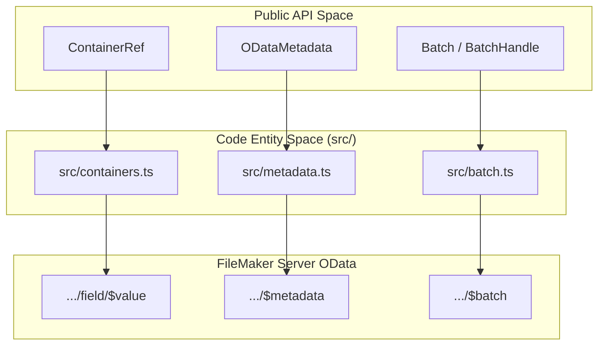
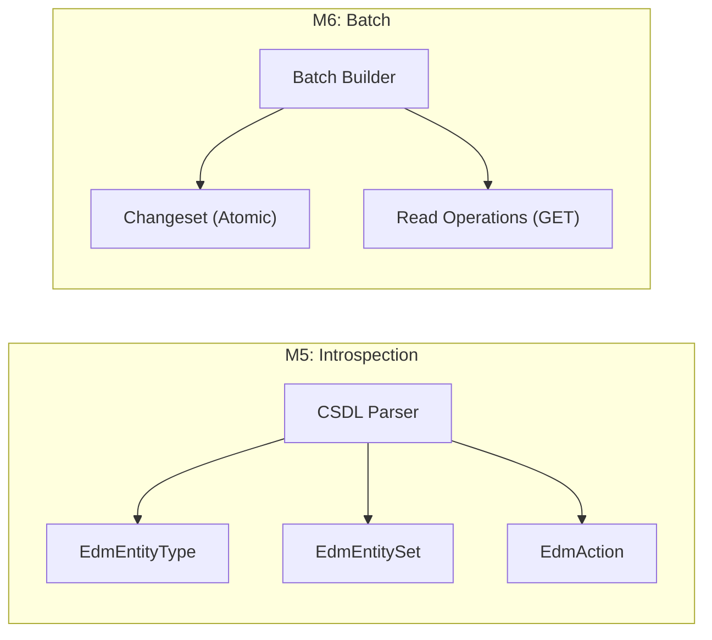

# Completed Milestones (M4–M6)

This page provides a high-level overview of the features delivered in milestones M4 through M6. These milestones expanded the library's capabilities beyond basic CRUD and script execution to include binary data handling, schema introspection, and performance optimizations via request batching. All three milestones are now complete.

## Milestone Summary

| Milestone | Feature | Version | Status |
| :--- | :--- | :--- | :--- |
| **M4 · Scripts** | Script execution at database / entity-set / record scope | v0.1.4 | ✓ Complete |
| **M4 · Containers** | Read, upload, stream, and delete binary container fields | v0.1.5 | ✓ Complete |
| **M5** | `$metadata` — fetch and parse the EDMX/CSDL XML schema | [Unreleased] | ✓ Complete |
| **M6** | `$batch` — multipart requests with atomic changesets | [Unreleased] | ✓ Complete |

Sources: [CHANGELOG.md]()

### Feature Architecture Mapping

The following diagram maps the public API components to their internal modules and the FileMaker Server OData endpoints they interact with.

**Implemented Entity Relationships**

---

## Containers (M4)

The M4 milestone delivered the `ContainerRef` class to manage binary I/O for FileMaker container fields. It supports downloading files as `Blob` or `ReadableStream`, uploading data via two FMS-documented wire formats, and clearing container content.

Key features delivered:
*   **Dual upload modes**: `binary` (PATCH to `…/<field>`) for images and PDFs; `base64` (PATCH to parent record with annotations) for arbitrary file types.
*   **MIME sniffing**: `contentType` is optional on upload — the library sniffs the type from magic bytes (PNG, JPEG, GIF, TIFF, PDF).
*   **Filename parsing**: Extracts filenames from `Content-Disposition` including RFC 5987 `filename*=UTF-8''…` form.
*   **Streaming**: `getStream()` returns the raw `ReadableStream` without buffering.

For the full API reference, see [Containers (M4)](05.1-containers-m4).

---

## Metadata (M5)

M5 delivered a lightweight regex-based XML parser for the `$metadata` EDMX/CSDL endpoint. The parser produces a typed `ODataMetadata` object with no external dependencies and a minimal bundle footprint.

Key features delivered:
*   `FMOData#metadata(opts?)` — fetches and parses the schema; results cached by default.
*   `FMOData#metadataXml(opts?)` — returns the raw XML string for debugging.
*   Parsed types: `ODataMetadata`, `EdmEntityType`, `EdmEntitySet`, `EdmProperty`, `EdmAction`.
*   `refresh: true` option to bypass the cache.

For the full API reference, see [Metadata (M5)](05.3-metadata-m5).

---

## Batch (M6)

M6 delivered the `$batch` multipart request builder, allowing multiple reads and atomic write groups to be sent in a single HTTP round-trip.

Key features delivered:
*   `FMOData#batch()` — returns a `Batch` builder.
*   `Batch#add(op)` — queues a read (GET entity-set with optional query params).
*   `Batch#changeset(build)` — defines an atomic write group (POST / PATCH / DELETE). All operations succeed or fail together.
*   `Batch#send(opts?)` — serialises, sends, and parses the multipart response into per-operation `BatchOpResult` objects.
*   OData `$`-prefixed query parameters (`$top`, `$filter`, etc.) are serialised without percent-encoding the `$`.

For the full API reference, see [Batch (M6)](05.4-batch-m6).

**Milestone Logic Flow**

Sources: [src/metadata.ts](), [src/batch.ts](), [CHANGELOG.md]()
