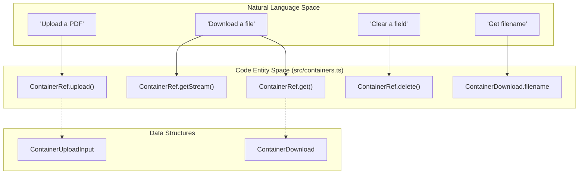
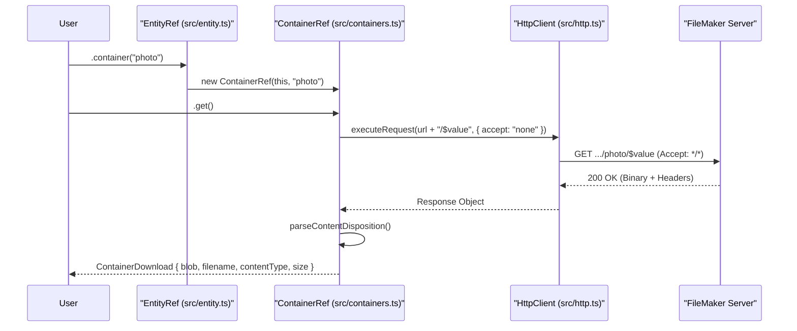

# Containers (M4)

The **Containers (M4)** milestone delivered the `ContainerRef` API, a dedicated system for interacting with FileMaker container field binary data. This milestone is complete as of **v0.1.5**. While standard OData fields are handled via JSON, FileMaker containers require specialized interactions with the `/$value` endpoint for streaming, uploading, and deleting binary content.

## Overview and Purpose

The Container API handles binary I/O without unnecessary memory buffering, supporting `Blob`, `ArrayBuffer`, and `Uint8Array` types across both Browser and Node.js (18+) environments.

### Key Features
- **Dual upload modes**: `binary` (PATCH raw bytes to `…/<field>`) for FMS-supported MIME types; `base64` (PATCH parent record with OData annotations) for arbitrary file types including ZIP, DOCX, etc.
- **MIME sniffing**: `contentType` is optional on upload — the library detects the MIME from magic bytes (PNG, JPEG, GIF, TIFF, PDF) and rejects unrecognised payloads up-front.
- **Streaming support**: `getStream()` returns the raw `ReadableStream` without buffering.
- **Filename parsing**: Automatic extraction of filenames from the `Content-Disposition` header, including RFC 5987 `filename*=UTF-8''…` for non-ASCII names.
- **Empty state handling**: Graceful handling of `Content-Length: 0` responses for empty container fields.

---

## Code Entity Mapping

The following diagram maps the natural language requirements for container operations to the specific classes and methods implemented in the codebase.

**Container API Entity Map**

---

## Implementation Details

### Data Flow: Container Download
When `ContainerRef.get()` is called, the library executes a `GET` request to the specific container field's `$value` endpoint using `Accept: */*` (not `application/octet-stream`, which FMS 22 misinterprets).

1. **URL Construction**: `/{EntitySet}({key})/{containerField}/$value`
2. **Header Parsing**: The library parses `Content-Disposition` to extract filenames, supporting both `filename="name.ext"` and RFC 5987 `filename*=UTF-8''name.ext` forms.
3. **Empty Handling**: If FMS returns `Content-Length: 0`, the library returns a `size: 0` object with an empty blob rather than throwing an error.

### Data Flow: Container Upload
`ContainerRef.upload()` supports two FMS-documented wire formats selectable via `input.encoding`:

- **`'binary'` (default)**: `PATCH …/<field>` with raw bytes plus `Content-Type` header. Restricted to PNG, JPEG, GIF, TIFF, and PDF per FMS documentation.
- **`'base64'`**: `PATCH …/<EntitySet>(<key>)` with `{ "<field>": "<base64>", "<field>@com.filemaker.odata.ContentType": "…", "<field>@com.filemaker.odata.Filename": "…" }`. Useful for arbitrary file types or updating multiple fields in one round-trip.

> **Note:** FMS has no per-field DELETE endpoint for record data. `ContainerRef.delete()` clears the container by PATCHing the parent record with `{ "<field>": null }`.

---

## Class Reference

### ContainerRef
Instantiated via `EntityRef.container(fieldName)`.

| Method | Return Type | Description |
| :--- | :--- | :--- |
| `get(opts?)` | `Promise<ContainerDownload>` | Fetches the binary data, content-type, filename, and size. |
| `getStream(opts?)` | `Promise<ReadableStream<Uint8Array>>` | Returns the raw response body stream without buffering. |
| `upload(input, opts?)` | `Promise<void>` | Uploads binary data using `binary` or `base64` encoding. |
| `delete(opts?)` | `Promise<void>` | Clears the container by PATCHing the parent record with `null`. |
| `url()` | `string` | Returns the fully qualified `$value` URL. |

### Interfaces

**ContainerDownload**
- `blob: Blob` — the binary content.
- `contentType: string` — the MIME type returned by the server.
- `filename?: string` — the parsed filename from the `Content-Disposition` header.
- `size: number` — total byte size.

**ContainerUploadInput**
- `data: Blob | ArrayBuffer | Uint8Array` — the payload.
- `contentType?: string` — MIME type; omit to let the library sniff from magic bytes.
- `filename?: string` — optional filename for the `Content-Disposition` header.
- `encoding?: 'binary' | 'base64'` — upload wire format (default: `'binary'`).

---

## Architectural Interaction

**Container Operation Sequence**

---

## Error Handling
Container operations follow the standard error flow of the library. If a request fails (e.g. 404 Not Found or 401 Unauthorized), the response is passed to `parseErrorResponse` to generate a typed `FMODataError`.

Specific cases:
- `getStream()` throws if the response body is `null`.
- FMS surfaces a missing container field as FM error 102, status 404, or a "does not exist" message — the live integration test soft-skips on all three patterns.

Sources: [src/containers.ts](), [CHANGELOG.md]()
