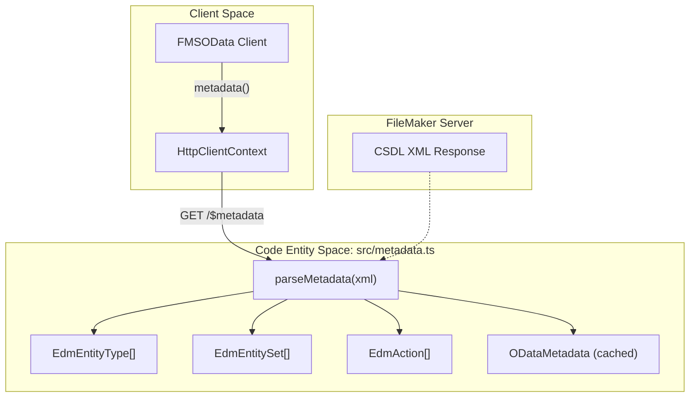
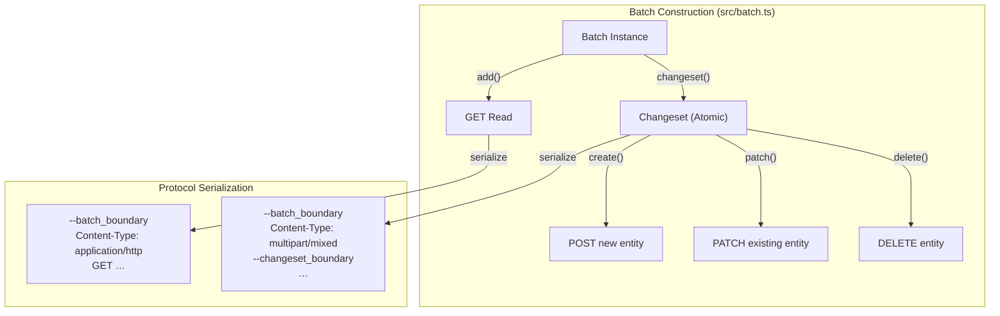

# Metadata and Batch (M5–M6)

Milestones M5 and M6 delivered schema introspection and transactional batch operations. Both milestones are **complete**. They allow `fms-odata-js` to act as a schema-aware client capable of complex, atomic interactions with FileMaker Server in a single HTTP round-trip.

## Overview

| Feature | Milestone | Status | Key Code Entities |
| :--- | :--- | :--- | :--- |
| **$metadata** | M5 | ✓ Complete | `ODataMetadata`, `EdmEntityType`, `EdmEntitySet`, `EdmProperty`, `EdmAction` |
| **$batch** | M6 | ✓ Complete | `Batch`, `Changeset`, `BatchHandle`, `BatchOpResult`, `BatchResult` |

---

## Milestone 5: Metadata (CSDL Parser)

M5 delivered the ability to fetch and parse the OData service metadata document (`$metadata`). The parser is implemented in `src/metadata.ts` using a lightweight, regex-based XML approach — no DOM parser or external dependencies.

### Public API
- **`FMSOData#metadata(opts?)`** — fetches `/$metadata`, parses the CSDL XML into an `ODataMetadata` object, and caches the result. Pass `{ refresh: true }` to bypass the cache.
- **`FMSOData#metadataXml(opts?)`** — returns the raw XML string (escape hatch for debugging or forward-compat parsing).

### Data Flow: Metadata Retrieval

### Key Metadata Types

1. **`ODataMetadata`** — root container with `namespace`, `entityTypes`, `entitySets`, `actions`, and `raw` (original XML).
2. **`EdmEntityType`** — a FileMaker table occurrence; has `name`, `keys[]`, `properties[]`, and `navigationProperties[]`.
3. **`EdmProperty`** — a field: `name`, `type` (e.g. `Edm.String`, `Edm.Decimal`), `nullable`, `maxLength?`.
4. **`EdmEntitySet`** — a layout/table exposed in OData: `name` and `entityType`.
5. **`EdmAction`** — a FileMaker script exposed as an OData action: `name`, `boundTo?`, `parameters[]`.

For the full API reference with code examples, see [Metadata (M5)](05.3-metadata-m5).

---

## Milestone 6: Batch Processing

M6 delivered the `$batch` endpoint builder, allowing multiple operations (GET, POST, PATCH, DELETE) to be grouped into a single `multipart/mixed` HTTP request. The implementation is in `src/batch.ts`.

### Public API
- **`FMSOData#batch()`** — returns a `Batch` builder instance.
- **`Batch#add(op)`** — queues a read operation (GET entity-set). Returns a `BatchHandle<T>`.
- **`Batch#changeset(build)`** — defines an atomic write group; all operations succeed or fail together.
- **`Batch#send(opts?)`** — serialises the multipart body, POSTs to `/<db>/$batch`, and parses the multipart response back into `BatchOpResult` objects.

### Logical Structure of a Batch

A `Batch` can contain individual `GET` reads or `Changesets`. A `Changeset` is an atomic unit containing one or more data-modifying operations.

### Implementation Notes
- **Boundary generation**: Unique `batch_<uuid>` and `changeset_<uuid>` boundaries generated via `crypto.randomUUID()`.
- **Query string encoding**: OData `$`-prefixed params (`$top`, `$filter`, etc.) are serialised without percent-encoding the `$` sign.
- **Response parsing**: Each MIME part's outer `application/http` headers are stripped before extracting the inner HTTP status line and body.
- **Atomicity**: If any operation in a `Changeset` fails, all `BatchHandle` promises for that changeset reject with the failing status.

For the full API reference with code examples, see [Batch (M6)](05.4-batch-m6).

---

## Testing

| Test Type | File | Coverage |
| :--- | :--- | :--- |
| Unit | `tests/unit/metadata.test.ts` | 15 tests — XML parsing, entity types, keys, properties, nav properties, entity sets, actions, caching, `AbortSignal` |
| Unit | `tests/unit/batch.test.ts` | 14 tests — serialisation, response parsing (single/multi/error/changeset), Content-Type header, `$batch` URL, `AbortSignal` |
| Integration | `tests/integration/live.test.ts` | Fetches and validates real schema; sends mixed batch with read + changeset create |

Sources: [src/metadata.ts](), [src/batch.ts](), [CHANGELOG.md]()
