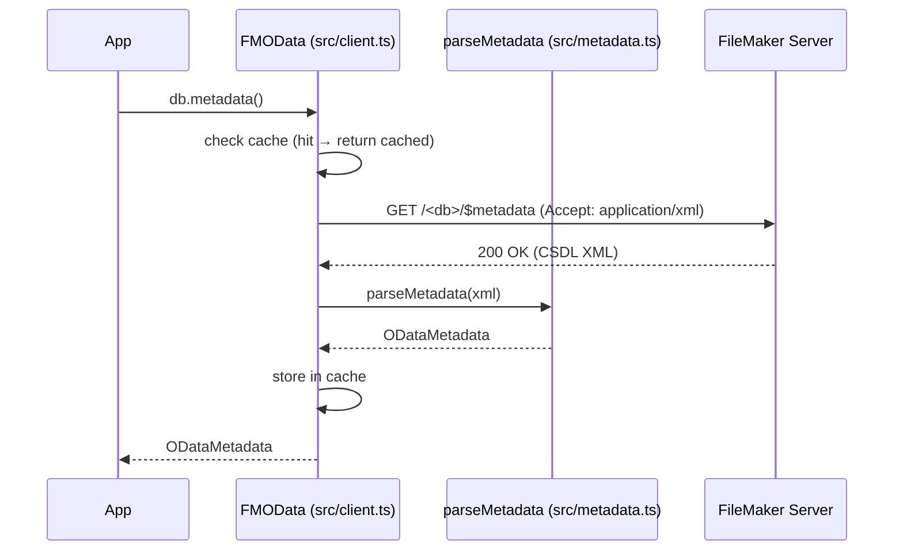

# Metadata — $metadata Parser (M5)

`fm-odata-js` can fetch and parse the OData CSDL/EDMX schema document exposed by FileMaker Server. The result is a fully typed `ODataMetadata` object that describes every table, field, key, and script in the database. **M5 is complete.**

---

## Quick Start

```ts
const meta = await db.metadata()

console.log(meta.namespace)        // "FileMaker"
console.log(meta.entitySets)       // [{ name: "contact", entityType: "FileMaker.contact" }, …]
console.log(meta.entityTypes)      // [{ name: "contact", keys: ["id"], properties: […] }, …]
console.log(meta.actions)          // FileMaker scripts exposed as OData Actions
console.log(meta.raw)              // original CSDL XML string

// Cached by default — force a fresh fetch:
const fresh = await db.metadata({ refresh: true })

// Raw XML for debugging / forward-compat:
const xml = await db.metadataXml()
```

---

## API Reference

### `FMOData#metadata(opts?)`

Fetches `GET /<db>/$metadata` (with `Accept: application/xml`), parses the response, and returns an `ODataMetadata` object. Results are cached on the `FMOData` instance; subsequent calls return the cached object without a network request.

**Options** (`MetadataOptions`):

| Option | Type | Default | Description |
| :--- | :--- | :--- | :--- |
| `refresh` | `boolean` | `false` | Force a re-fetch, bypassing the internal cache. |
| `signal` | `AbortSignal` | — | Cancellation signal forwarded to `fetch`. |

**Returns:** `Promise<ODataMetadata>`

---

### `FMOData#metadataXml(opts?)`

Returns the raw CSDL XML string without parsing. Useful for debugging or forwarding to a code-generation tool.

**Options:** `RequestOptions` (`signal?`)

**Returns:** `Promise<string>`

---

## Type Reference

### `ODataMetadata`

The root object returned by `metadata()`.

| Property | Type | Description |
| :--- | :--- | :--- |
| `namespace` | `string` | Schema namespace (e.g. `"FileMaker"`). |
| `entityTypes` | `EdmEntityType[]` | All entity type definitions (tables). |
| `entitySets` | `EdmEntitySet[]` | All entity sets exposed in the OData endpoint. |
| `actions` | `EdmAction[]` | FileMaker scripts exposed as OData Actions. |
| `raw` | `string` | The original CSDL XML for forward-compatibility. |

---

### `EdmEntityType`

Represents a FileMaker table occurrence.

| Property | Type | Description |
| :--- | :--- | :--- |
| `name` | `string` | Entity type name (e.g. `"contact"`). |
| `keys` | `string[]` | Primary key field name(s). |
| `properties` | `EdmProperty[]` | All scalar fields. |
| `navigationProperties` | `{ name: string; target: string; collection: boolean }[]` | Related entity navigations (portals). |

---

### `EdmProperty`

A single field on an entity type.

| Property | Type | Description |
| :--- | :--- | :--- |
| `name` | `string` | Field name. |
| `type` | `string` | EDM type string, e.g. `"Edm.String"`, `"Edm.Decimal"`, `"Edm.DateTimeOffset"`. |
| `nullable` | `boolean` | Whether the field accepts null values. |
| `maxLength` | `number \| undefined` | Max character length (text fields only). |

---

### `EdmEntitySet`

An entity set (layout / table) exposed in the OData service.

| Property | Type | Description |
| :--- | :--- | :--- |
| `name` | `string` | Entity set name used in URLs (e.g. `"contact"`). |
| `entityType` | `string` | Fully qualified entity type (e.g. `"FileMaker.contact"`). |

---

### `EdmAction`

A FileMaker script exposed as an OData Action.

| Property | Type | Description |
| :--- | :--- | :--- |
| `name` | `string` | Script name (e.g. `"Script.Ping"`). |
| `boundTo` | `string \| undefined` | Entity type this action is bound to, if any. |
| `parameters` | `{ name: string; type: string }[]` | Action parameters. |

---

## Data Flow



---

## Implementation Notes

- **Parser**: Regex-based extraction in `src/metadata.ts` (~200 LoC). No DOM parser, no external dependencies — keeps the bundle minimal.
- **Caching**: Stored as `_metadataCache` on the `FMOData` instance. Thread-safe for single-threaded JS environments; `refresh: true` replaces the cache.
- **Namespace prefixes**: The parser handles both `<Tag>` and `<prefix:Tag>` forms as used in real FMS CSDL responses.
- **FMS scope**: Parses `EntityType`, `EntitySet`, and `Action` elements. `Function`, `ComplexType`, and `EnumType` are not emitted by FMS and are ignored.

---

## Tests

15 unit tests in `tests/unit/metadata.test.ts` covering:
- `parseMetadata()` — namespace, entity types with keys, properties (type/nullability), navigation properties, entity sets, actions, raw XML preservation, malformed XML rejection
- `FMOData#metadataXml()` — correct endpoint, `Accept: application/xml` header
- `FMOData#metadata()` — full parse, caching (same object reference on repeat call), `refresh: true` forces refetch, `AbortSignal` forwarding

Live integration test in `tests/integration/live.test.ts`: fetches real schema from the configured FMS, asserts `namespace`, `entitySets.length > 0`, `entityTypes.length > 0`, at least one entity type with keys, cache hit returns same reference, `refresh: true` returns new object.

Sources: [src/metadata.ts](), [tests/unit/metadata.test.ts](), [CHANGELOG.md]()
