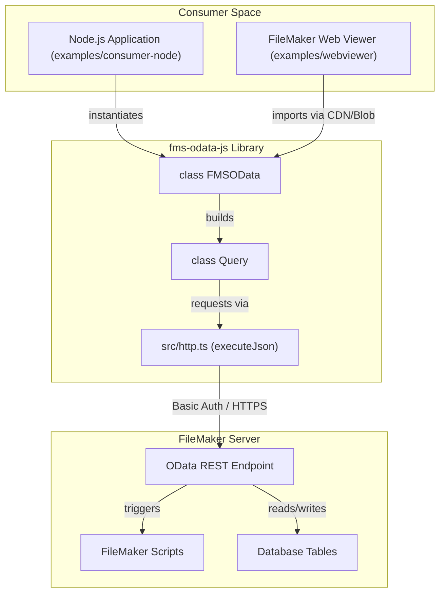
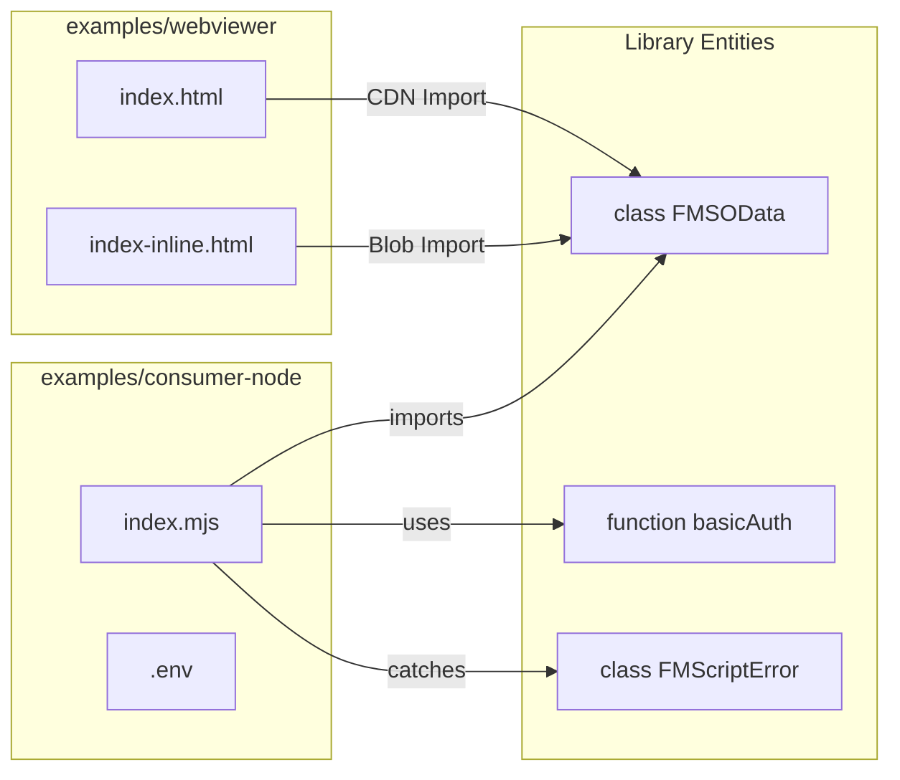

# Examples and Integration

The `fms-odata-js` library provides two primary reference implementations to demonstrate its versatility across different JavaScript environments. These examples serve as both a "smoke test" for the library's features and a template for developers to integrate the library into their own projects.

The examples demonstrate the library's ability to handle the specific quirks of FileMaker Server (FMS) OData, such as authentication requirements, query construction, and script execution error handling.

## Integration Architecture

The following diagram illustrates how the examples interact with the `fms-odata-js` library and a FileMaker Server instance.

**System Integration Overview**

Sources: [examples/consumer-node/README.md:1-15](), [examples/webviewer/README.md:1-17](), [README.md:340-353]()

---

## Node.js Consumer Example

The Node.js example is located in `examples/consumer-node`. It demonstrates how to use the library as a dependency in a backend or CLI environment. This implementation highlights the library's zero-dependency design and its compatibility with standard Node.js environment variables.

### Key Features

*   **Environment Configuration**: Uses `node --env-file` or `export` to manage credentials via standardized env vars (`FM_SERVER`, `FM_DATABASE`, `FM_USER`, `FM_PASSWORD`, `FM_VERIFY_SSL`). Legacy `FM_ODATA_*` names are accepted as fallbacks [examples/consumer-node/README.md:38-57]().
*   **Query Pipeline**: Demonstrates the fluent API for fetching data, specifically the `from().top().get()` pattern [examples/consumer-node/README.md:95-96]().
*   **Script Execution**: Shows how to invoke a FileMaker script at the database scope and handle specific error codes, such as FileMaker error `104` (script missing) [examples/consumer-node/README.md:68-80]().
*   **TypeScript Support**: Provides a blueprint for using interfaces to provide type safety for OData results [examples/consumer-node/README.md:86-98]().

For a detailed walkthrough of the Node.js implementation, see **[Node.js Consumer Example](#6.1)**.

---

## Web Viewer Example

The Web Viewer example is located in `examples/webviewer`. It showcases a "single-page app" (SPA) pattern that can be embedded directly into a FileMaker Pro layout. This implementation is critical for developers building modern, interactive UIs inside FileMaker.

### Key Features

*   **Distribution Variants**: Offers a standard `index.html` (CDN-loaded) and an `index-inline.html` (fully self-contained using a Blob URL trick) to support offline or sandboxed environments [examples/webviewer/README.md:10-17]().
*   **CORS & Origin Handling**: Addresses the unique challenges of running code in a `null` origin Web Viewer [examples/webviewer/README.md:69-72]().
*   **UI Integration**: Features a tabbed grid interface that renders data from multiple tables (`contact`, `email`, etc.) using the library's `QueryResult` [examples/webviewer/README.md:7-9]().
*   **Error Visualization**: Directly surfaces `FMSODataError` details, including HTTP status and FMS-specific error codes, to the user [examples/webviewer/README.md:55-56]().

For details on embedding and CORS configuration, see **[Web Viewer Example](#6.2)**.

---

## Implementation Comparison

The following table summarizes the differences between the two reference implementations:

| Feature | Node.js Consumer | Web Viewer |
| :--- | :--- | :--- |
| **Runtime** | Node.js (v20.6+) | Browser / Web Kit |
| **Import Method** | `file:` dependency / npm | CDN (jsDelivr) or Inlined |
| **Auth Strategy** | `basicAuth()` via Env Vars | `basicAuth()` via UI Input |
| **TLS Handling** | `FM_VERIFY_SSL=0` | Browser Certificate Exception |
| **Primary Use Case** | Automation / Backend Sync | In-layout Interactive UI |

**Code Entity Association**

Sources: [examples/consumer-node/README.md:87-98](), [examples/webviewer/README.md:50-51]()

---
**Sources:**

*   [examples/consumer-node/README.md:1-274]()
*   [examples/webviewer/README.md:1-180]()
