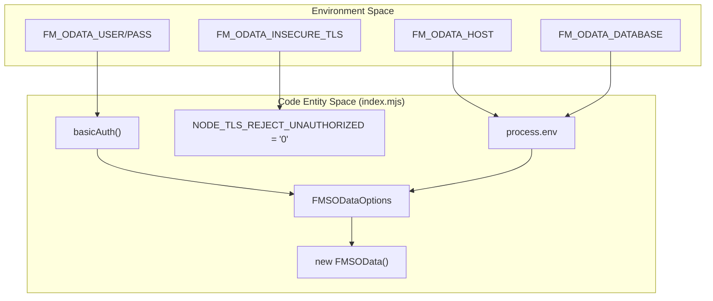
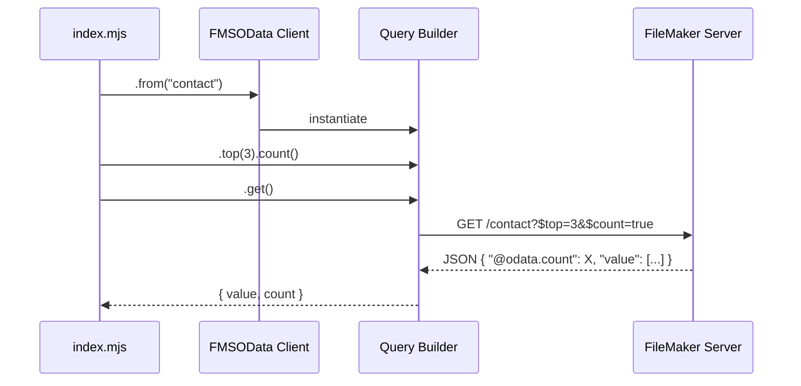
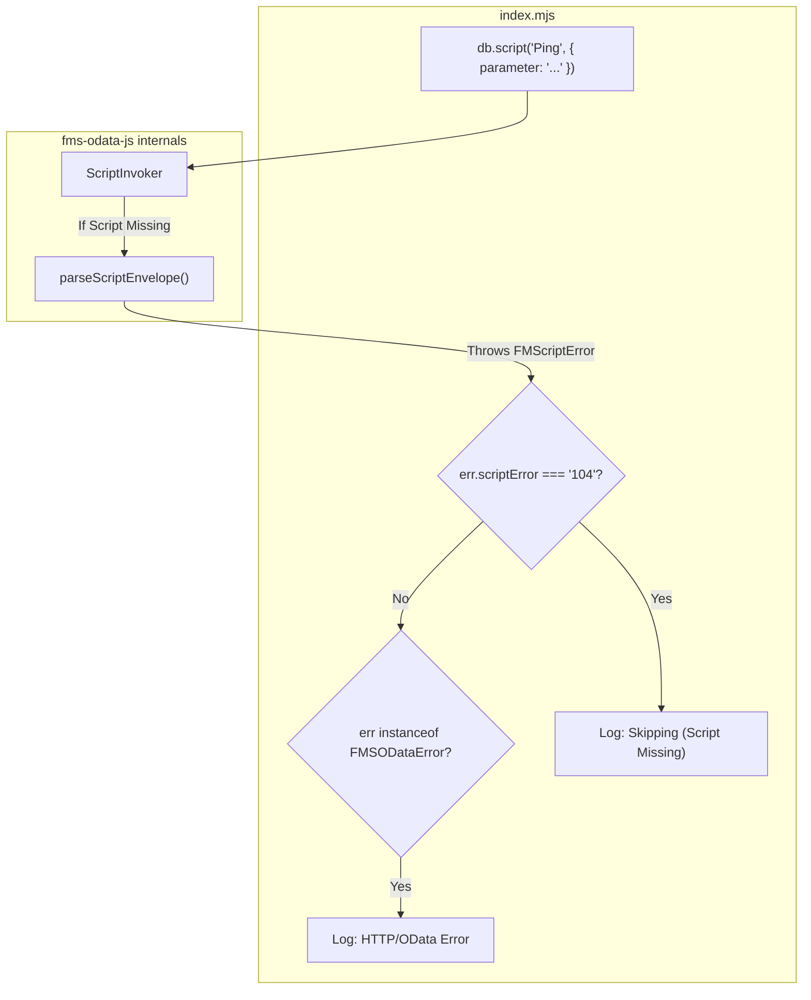

# Node.js Consumer Example

The `examples/consumer-node` project provides a minimal, functional demonstration of how to integrate `fms-odata-js` into a standalone Node.js environment. It illustrates the standard pattern for library consumption, query building, script execution, and robust error handling [examples/consumer-node/README.md:3-8]().

## Local Dependency Pattern

The example uses a `file:` dependency in its `package.json` to reference the parent library. This pattern allows for local development where changes in the library source (after a build) are immediately available to the consumer via a symlink [examples/consumer-node/package.json:11](), [examples/consumer-node/README.md:28-30]().

### Local Dependency Setup
| Step | Action | Command |
| :--- | :--- | :--- |
| 1 | Navigate to example | `cd examples/consumer-node` |
| 2 | Install dependencies | `npm install` |
| 3 | Run the example | `node --env-file=../../.env index.mjs` |

Sources: [examples/consumer-node/package.json:1-14](), [examples/consumer-node/README.md:21-39]()

## Environment Configuration

The consumer relies on environment variables to manage FileMaker Server (FMS) credentials and connection settings.

### Required Variables
*   `FM_ODATA_HOST`: The full URL of the FMS instance [examples/consumer-node/index.mjs:7]().
*   `FM_ODATA_DATABASE`: The target FileMaker filename [examples/consumer-node/index.mjs:8]().
*   `FM_ODATA_USER` / `FM_ODATA_PASSWORD`: Credentials for an account with OData privileges [examples/consumer-node/index.mjs:9-10]().
*   `FM_ODATA_INSECURE_TLS`: Set to `1` to bypass certificate validation for LAN-based FMS instances using self-signed certificates [examples/consumer-node/index.mjs:11]().

### Node.js Entity Mapping
The following diagram maps environment variables to the logic within `index.mjs`.

**Environment to Logic Mapping**

Sources: [examples/consumer-node/index.mjs:23-55]()

## Client Instantiation and Query Pipeline

The example instantiates the `FMSOData` client and uses the fluent `Query` builder to fetch data from the `Contacts.fmp12` solution [examples/consumer-node/index.mjs:50-55]().

### The Query Pipeline
The consumer iterates through a list of tables (`contact`, `address`, `email`, `phone`) and executes a pipeline:
1.  `from(table)`: Sets the entity set [examples/consumer-node/index.mjs:61]().
2.  `top(3)`: Limits the result set to 3 records [examples/consumer-node/index.mjs:61]().
3.  `count()`: Requests the total record count from the server [examples/consumer-node/index.mjs:61]().
4.  `get()`: Executes the HTTP request and returns a `QueryResult` [examples/consumer-node/index.mjs:61]().

**Query Execution Flow**

Sources: [examples/consumer-node/index.mjs:59-66]()

## Script Execution and Error Handling

The example demonstrates calling a FileMaker script at the database scope using `db.script()` [examples/consumer-node/index.mjs:83-85]().

### Tiered Error Handling
The script execution block implements a tiered catch mechanism to handle different failure modes gracefully:

1.  **`FMScriptError` (Code 104)**: Specifically checks for FileMaker error `104` (Script Missing). This allows the example to "skip" the script demo if the solution hasn't been updated with the "Ping" script [examples/consumer-node/index.mjs:88-89]().
2.  **`FMSODataError`**: Catches general OData or HTTP errors (e.g., 401 Unauthorized, 404 Not Found) and logs the status and message [examples/consumer-node/index.mjs:90-91]().
3.  **Generic Error**: Re-throws unexpected JavaScript errors [examples/consumer-node/index.mjs:93]().

### Script Interaction
The script demo passes a string parameter and expects a `scriptResult` back from FileMaker [examples/consumer-node/index.mjs:83-86]().

**Script Execution Logic**

Sources: [examples/consumer-node/index.mjs:81-95](), [examples/consumer-node/README.md:68-79]()
