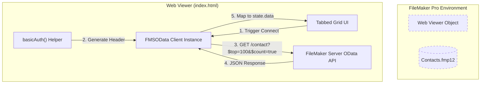
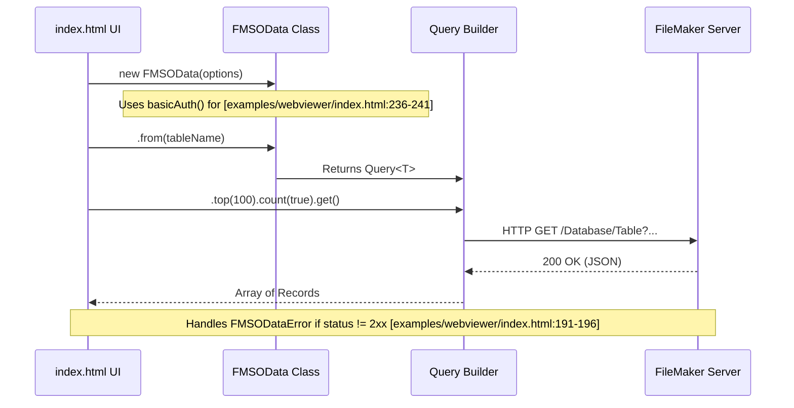

# Web Viewer Example

The `examples/webviewer` directory provides a reference implementation for integrating `fms-odata-js` into FileMaker Pro Web Viewers. It demonstrates how to bypass common environment constraints, such as the `null` origin of Web Viewers, and how to handle FileMaker Server (FMS) specific quirks like the `$count` endpoint limitation.

## Deployment Variants

The example includes two distinct HTML strategies to accommodate different networking environments and security requirements.

| File | Strategy | Use Case |
| :--- | :--- | :--- |
| `index.html` | **CDN Loaded** | Standard environments with internet access; ensures the latest library version via jsDelivr. |
| `index-inline.html` | **Self-Contained** | Offline/Air-gapped LANs; avoids external JS requests by inlining the entire library. |

### The Inline ESM Trick

Because the library is distributed as an ECMAScript Module (ESM), it cannot be simply pasted into a `<script>` tag in older browsers or certain sandboxed environments. `index-inline.html` uses a "Blob URL" technique to load the inlined library code as a module:

1. The minified library code is stored in a non-executable script tag: `<script id="fms-odata-bundle" type="application/javascript+esm-source">`. [examples/webviewer/index-inline.html:92-93]()
2. A small loader script extracts this text, creates a `Blob`, and generates a `URL.createObjectURL()`. [examples/webviewer/index-inline.html:206-209]()
3. The application then uses a dynamic `import()` on that Blob URL to instantiate the client. [examples/webviewer/index-inline.html:211-212]()

Sources: [examples/webviewer/README.md:10-17](), [examples/webviewer/index.html:154-155](), [examples/webviewer/index-inline.html:92-110](), [examples/webviewer/index-inline.html:206-215]()

## Data Flow and UI Architecture

The example implements a tabbed grid UI that fetches data from four tables in the `Contacts.fmp12` demo database: `contact`, `email`, `address`, and `phone`. [examples/webviewer/index.html:157-158]()

### Connection Lifecycle

1. **Configuration**: User provides FMS Host, Database, and Credentials. [examples/webviewer/index.html:128-142]()
2. **Instantiation**: The app creates an `FMSOData` instance using `basicAuth()`. [examples/webviewer/index.html:236-241]()
3. **Parallel Fetching**: The app iterates through the `TABLES` array, triggering asynchronous OData requests for each. [examples/webviewer/index.html:243-247]()
4. **Result Handling**: Data is stored in a local `state` object. If a request fails, the `FMSODataError` (including HTTP status and FMS error code) is captured and rendered in the specific tab. [examples/webviewer/index.html:188-196]()

### Web Viewer Implementation Diagram

This diagram shows the relationship between the FileMaker environment and the code entities within the Web Viewer.



Sources: [examples/webviewer/index.html:154-164](), [examples/webviewer/index.html:235-255](), [examples/webviewer/README.md:48-56]()

## Integration Patterns

### FileMaker Calculation Embedding

To load the example into a Web Viewer without hosting a static file, the HTML can be passed as a `data:` URL. The `README` provides a pattern for handling special characters in the calculation:

```filemaker
"data:text/html;charset=utf-8," & 
  Substitute ( CalculationReturningHtml ; [ "#" ; "%23" ] ; [ "&" ; "%26" ] )
```

Sources: [examples/webviewer/README.md:58-68]()

### CORS and Origin Requirements

Web Viewers typically run under a `null` or `fmp://` origin. For the Web Viewer to successfully communicate with FileMaker Server via OData, the server must be configured to allow these origins or provide permissive `Access-Control-Allow-Origin` headers. [examples/webviewer/README.md:70-72]()

### FMS Quirk Handling

The example demonstrates the library's built-in workarounds for FileMaker Server's OData implementation:

* **Inline Count**: Instead of using the `/$count` endpoint (which FMS does not support), the library uses the `?$count=true` query parameter. [examples/webviewer/README.md:80-80]()
* **Error Normalization**: The UI uses `FMSODataError` to extract the specific FMS error code from the OData response envelope. [examples/webviewer/index.html:191-196]()

## Component Interaction

The following diagram associates the UI components with the specific `fms-odata-js` classes and methods they utilize.



Sources: [examples/webviewer/index.html:154-158](), [examples/webviewer/index.html:243-255](), [examples/webviewer/README.md:48-56]()

## Demo Database: Contacts.fmp12

The example is designed to work with the provided `Contacts.fmp12` file.

* **Tables**: `contact`, `email`, `address`, `phone`. [examples/webviewer/index.html:157]()
* **Credentials**: Default `admin` / `admin`. [examples/webviewer/README.md:38-43]()
* **Requirement**: The OData API must be enabled in the FileMaker Server Admin Console for the database to be accessible. [examples/webviewer/README.md:21-25]()

Sources: [examples/webviewer/README.md:21-47](), [examples/webviewer/Contacts.fmp12:1-14]()
