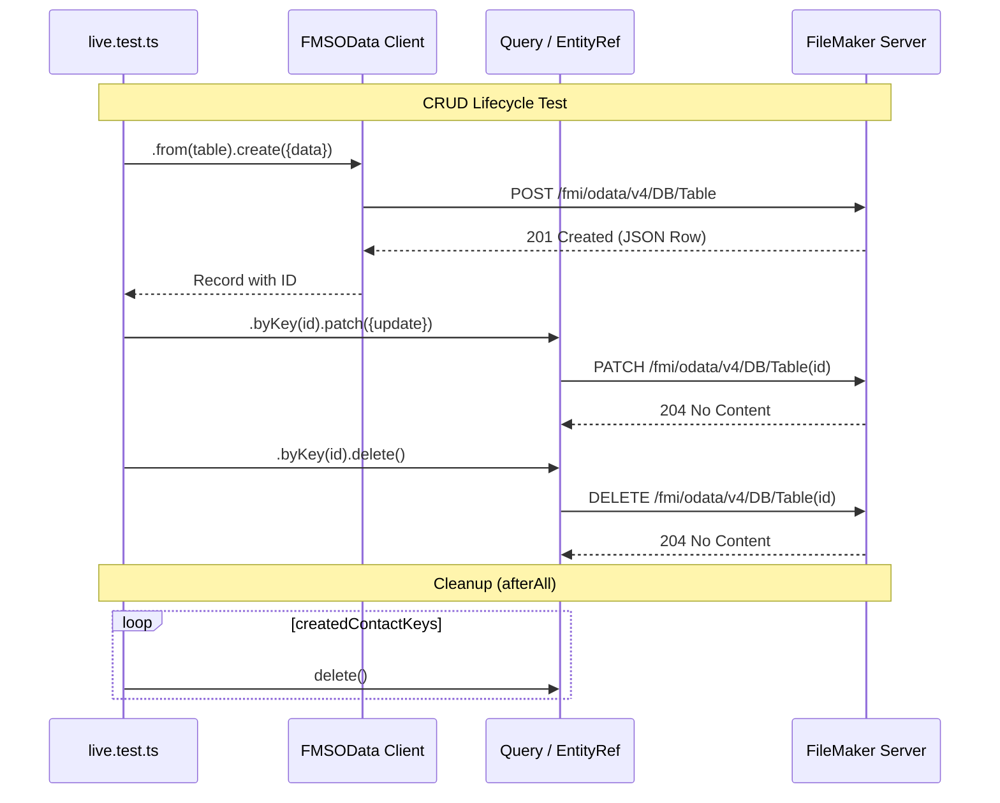
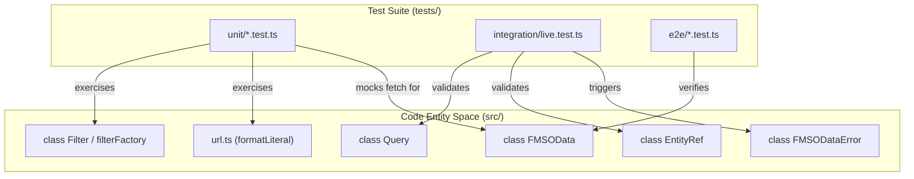

# Unit and Integration Tests

This page documents the testing infrastructure for `fms-odata-js`, which utilizes **Vitest** for unit and integration testing and **Playwright** for end-to-end (e2e) verification. The suite is designed to be fast and offline-first by default, with an opt-in mechanism for live testing against real FileMaker Server (FMS) instances. The current suite runs **182 unit tests** (plus 8 skipped live integration tests) across 10 test files.

## Test Infrastructure Overview

The testing environment is split into three distinct layers:

1.  **Unit Tests**: Fast, isolated tests using mocked fetch calls to verify URL generation, filter logic, and error parsing.
2.  **Live Integration Tests**: Opt-in tests that execute real CRUD and Script operations against a FileMaker Server.
3.  **E2E Tests**: Playwright-based tests designed to verify library behavior in browser environments (e.g., FileMaker Web Viewer).

### Configuration

The test runner is configured via `vitest.config.ts`, which sets the environment to `node` and defines coverage thresholds using the `v8` provider [vitest.config.ts:3-13]().

| Feature | Tool | Path |
| :--- | :--- | :--- |
| Unit Runner | Vitest | `tests/unit/*.test.ts` |
| Integration Runner | Vitest | `tests/integration/live.test.ts` |
| E2E Runner | Playwright | `tests/e2e/` |
| Coverage | c8/v8 | `coverage/` |

**Sources:** [vitest.config.ts:3-13](), [playwright.config.ts:3-11]()

---

## Unit Test Suite

The unit tests verify the internal logic of the library without network side effects. These tests use `vi.fn()` to mock the `fetch` implementation provided to the `FMSOData` constructor [tests/unit/scripts.test.ts:16-27]().

### URL and Literal Formatting

`tests/unit/url.test.ts` exercises the `src/url.ts` utility module. It ensures that:

*   String literals double their single quotes (e.g., `O'Brien` → `'O''Brien'`) [tests/unit/url.test.ts:11-27]().
*   Dates are formatted as UTC ISO-8601 strings specifically *without* milliseconds, as required by FMS [tests/unit/url.test.ts:29-38]().
*   Path segments are correctly percent-encoded (e.g., spaces to `%20`) [tests/unit/url.test.ts:105-113]().

### Query and Filter Logic

`tests/unit/query.test.ts` validates the `Query` builder and `Filter` factory.

*   **Logical Composition**: Verifies that `.and()`, `.or()`, and `.not()` produce correctly parenthesized OData expressions [tests/unit/query.test.ts:45-63]().
*   **Terminal Methods**: Verifies that `select`, `top`, `skip`, and `count` correctly populate the query string [tests/unit/query.test.ts:134-145]().
*   **Nested Expands**: Validates the serialization of `$expand` with nested options using the `;` separator [tests/unit/query.test.ts:168-175]().

### Script Invocation

`tests/unit/scripts.test.ts` ensures that script calls target the correct URL patterns based on scope:

*   **Database Scope**: `.../Script.Name` [tests/unit/scripts.test.ts:29-47]().
*   **Entity Scope**: `.../Table/Script.Name` [tests/unit/scripts.test.ts:83-94]().
*   **Record Scope**: `.../Table(Key)/Script.Name` [tests/unit/scripts.test.ts:115-126]().

### Error Handling

`tests/unit/errors.test.ts` verifies the `parseErrorResponse` function, which handles both standard OData JSON error envelopes and the specific XML error envelopes returned by FileMaker Server during authentication failures [tests/unit/errors.test.ts:23-62]().

### Containers

`tests/unit/containers.test.ts` (35 tests) covers the full `ContainerRef` surface: URL construction, `get()` with filename parsing (quoted, unquoted, RFC 5987 `filename*`), empty container handling, `getStream()`, `upload()` in both `binary` and `base64` modes, `delete()`, MIME sniffing via `sniffContainerMime()`, and `Content-Disposition` formatting helpers.

### Metadata

`tests/unit/metadata.test.ts` (15 tests) covers the `parseMetadata()` XML parser (namespace, entity types with keys, properties, navigation properties, entity sets, actions, raw XML preservation, malformed XML rejection), `FMSOData#metadataXml()` endpoint and header, and `FMSOData#metadata()` (full parse, caching, `refresh: true`, `AbortSignal`).

### Batch

`tests/unit/batch.test.ts` (14 tests) covers batch serialisation (single read, multiple reads, changeset with create, PATCH + DELETE, string key quote escaping), response parsing (single/multi/error/mixed read+changeset), request plumbing (`Content-Type` header, `$batch` URL, POST method), `AbortSignal`, and `If-Match` headers in changesets.

**Sources:** [tests/unit/url.test.ts](), [tests/unit/query.test.ts](), [tests/unit/scripts.test.ts](), [tests/unit/errors.test.ts](), [tests/unit/containers.test.ts](), [tests/unit/metadata.test.ts](), [tests/unit/batch.test.ts]()

---

## Live Integration Tests

The integration suite in `tests/integration/live.test.ts` is skipped unless the environment variable `FM_ODATA_LIVE=1` is set [tests/integration/live.test.ts:18]().

### Data Flow: CRUD Lifecycle

The `live.test.ts` suite performs a full round-trip lifecycle to ensure compatibility with FMS behavior:

1.  **Create**: POSTs a new record and uses `findPrimaryKey` to identify the generated ID from the response [tests/integration/live.test.ts:48-61]().
2.  **Read**: Fetches the record by the discovered key [tests/integration/live.test.ts:63-65]().
3.  **Update**: Performs a `PATCH` and verifies the change [tests/integration/live.test.ts:67-75]().
4.  **Delete**: Removes the record and verifies that a subsequent `GET` returns a `404` via `FMSODataError` [tests/integration/live.test.ts:77-89]().

### Script Round-Trip

The suite includes a test for a "Ping" script. It expects a script that echoes back a parameter. It specifically handles FileMaker Error **104** (Script Missing) as a soft skip rather than a failure, allowing the suite to run against databases without the specific test script installed [tests/integration/live.test.ts:91-112]().

### Cleanup Mechanism

To prevent data pollution, the suite maintains a `createdContactKeys` array. An `afterAll` hook attempts to delete every record created during the session, even if the tests failed [tests/integration/live.test.ts:29-39]().

### Integration Test Logic Flow

The following diagram illustrates the relationship between the test runner, the library entities, and the remote FileMaker Server.

Title: Live Integration Test Sequence

**Sources:** [tests/integration/live.test.ts:18-112](), [tests/integration/live.test.ts:29-39]()

---

## Technical Mapping: Test Entities to Code

This diagram maps the testing constructs to the specific classes and functions they exercise within the codebase.

Title: Testing Surface Area Map

**Sources:** [tests/unit/client.test.ts:4-12](), [tests/unit/query.test.ts:23-24](), [tests/unit/url.test.ts:68-103](), [tests/unit/errors.test.ts:6-21](), [tests/integration/live.test.ts:47-89]()

---

## Execution Commands

| Command | Description |
| :--- | :--- |
| `npm test` | Runs all unit tests. |
| `npm run test:live` | Runs unit + integration tests (requires `.env` setup). |
| `npm run coverage` | Generates HTML coverage report in `./coverage`. |
| `npx playwright test` | Executes the Playwright e2e suite. |

**Sources:** [vitest.config.ts:4-11](), [playwright.config.ts:3-11]()
