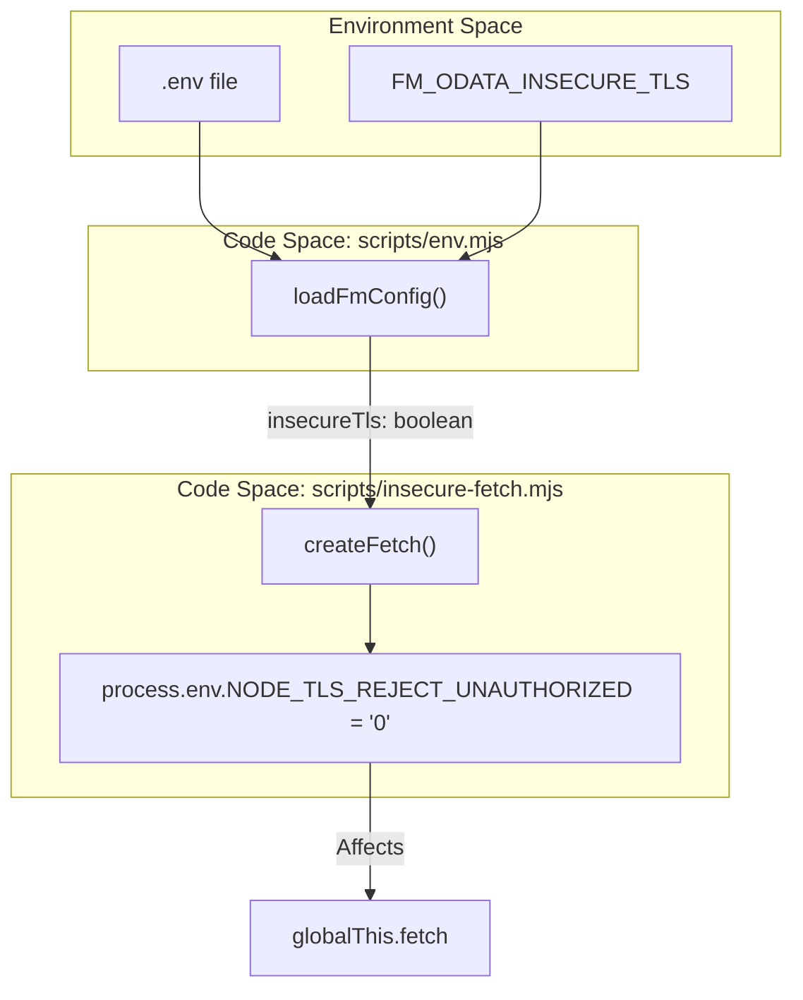
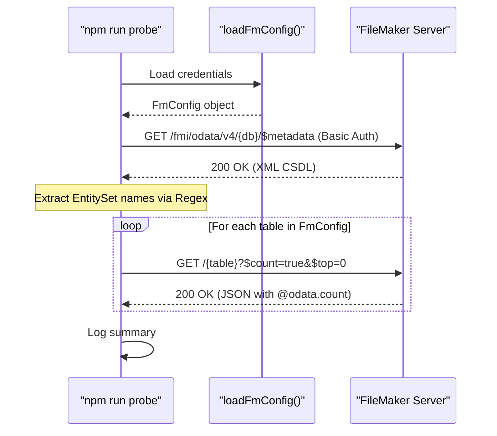

# Developer Scripts and Probe Utility

This page documents the internal tooling and scripts located in the `scripts/` directory of the `fms-odata-js` repository. These utilities facilitate environment configuration, connectivity testing against FileMaker Server (FMS), and local development workflows.

## Overview

The developer scripts are designed to be zero-dependency (using native Node.js features like `node:fs` and `node:path`) to ensure they remain functional even before `npm install` is run or in restricted environments. They handle the loading of sensitive credentials, manage TLS certificate verification for development environments, and provide a diagnostic "probe" to verify OData endpoint health.

| Script | Purpose |
| :--- | :--- |
| `env.mjs` | Custom `.env` parser and configuration loader. |
| `insecure-fetch.mjs` | Factory for a `fetch` client that can bypass TLS validation. |
| `probe.mjs` | A CLI utility to verify FMS connectivity and schema visibility. |

## Environment Management (`env.mjs`)

The `env.mjs` module provides a lightweight mechanism to load environment variables without requiring external dependencies like `dotenv`. It specifically targets variables defined in `.env.sample` [.env.sample:1-44]().

### Implementation Details

The loader reads the `.env` file from the repository root [scripts/env.mjs:8-11](). It parses lines as `KEY=VALUE` pairs, ignoring comments (starting with `#`) and blank lines [scripts/env.mjs:20-22](). Values can optionally be wrapped in single or double quotes, which are stripped during parsing [scripts/env.mjs:27-32]().

### Key Functions

- **`loadEnvFile(path)`**: Reads the raw file and populates `process.env` if the key is not already set [scripts/env.mjs:11-38]().
- **`loadFmConfig()`**: Validates that required variables (`FM_ODATA_HOST`, `FM_ODATA_DATABASE`, `FM_ODATA_USER`, `FM_ODATA_PASSWORD`) are present [scripts/env.mjs:43-51](). It returns a typed `FmConfig` object [scripts/env.d.mts:1-14]() containing normalized host URLs and table mappings [scripts/env.mjs:52-66]().

Sources: [scripts/env.mjs:1-67](), [scripts/env.d.mts:1-18](), [.env.sample:1-44]()

## Insecure Fetch Utility (`insecure-fetch.mjs`)

FileMaker Server often uses self-signed certificates when deployed on LAN IPs. To allow developer tools to interact with these servers, the `createFetch` factory provides a way to disable TLS verification.

### Logic Flow

If `insecureTls` is enabled, the script sets `process.env.NODE_TLS_REJECT_UNAUTHORIZED = '0'` [scripts/insecure-fetch.mjs:21-25](). This affects the built-in Node.js `fetch` (based on `undici`) for the lifetime of the process [scripts/insecure-fetch.mjs:22-24](). To prevent accidental production use, a warning is logged to the console the first time this is activated [scripts/insecure-fetch.mjs:26-31]().

### Data Flow: Fetch Configuration

The following diagram illustrates how configuration flows from environment variables to the fetch implementation.

**Fetch Configuration Data Flow**

Sources: [scripts/insecure-fetch.mjs:1-34](), [scripts/env.mjs:58-58]()

## Probe Utility (`probe.mjs`)

The `probe.mjs` script is a diagnostic tool used via `npm run probe`. It performs a multi-step check to ensure the OData API is reachable and the credentials have sufficient privileges.

### Connectivity Logic

1.  **Configuration**: Loads settings via `loadFmConfig()` and initializes an insecure fetch if requested [scripts/probe.mjs:11-12]().
2.  **Authentication**: Manually constructs an HTTP Basic Auth header using `Buffer.from().toString('base64')` [scripts/probe.mjs:25-25]().
3.  **Metadata Check**: Fetches the `$metadata` XML document [scripts/probe.mjs:28-32](). It uses a regex to extract and list all available `EntitySet` names [scripts/probe.mjs:41-43]().
4.  **Row Counting**: Iterates through the tables defined in the config (e.g., contact, address) and performs a count request [scripts/probe.mjs:49-51]().

### FileMaker Quirks Handled

The probe accounts for specific FMS behaviors:

-   **Authentication**: Uses Basic Auth directly, as FMS OData does not accept Data API bearer tokens [scripts/probe.mjs:23-25]().
-   **Count Endpoint**: Instead of the standard `/EntitySet/$count` (which FMS returns 400 for), it uses the query string workaround: `?$count=true&$top=0` [scripts/probe.mjs:46-50]().

**Probe Execution Sequence**

Sources: [scripts/probe.mjs:1-62](), [scripts/env.mjs:43-66]()

## Developer Commands

The following `npm` scripts are defined in `package.json` to facilitate the development lifecycle:

| Command | Action |
| :--- | :--- |
| `npm run probe` | Executes `scripts/probe.mjs` to test connectivity. |
| `npm run lint` | Runs ESLint to check for code style and potential errors. |
| `npm run format` | Runs Prettier to enforce consistent code formatting. |
| `npm run size` | Uses `esbuild` to bundle the library and reports the minified/gzipped size. |

The formatting and linting rules are governed by the `.editorconfig` file, which specifies a 2-space indent, UTF-8 charset, and LF line endings [.editorconfig:1-13]().

Sources: [.editorconfig:1-13](), [scripts/probe.mjs:1-7]()
