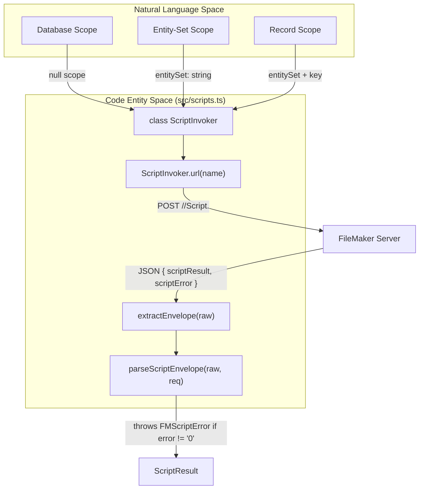
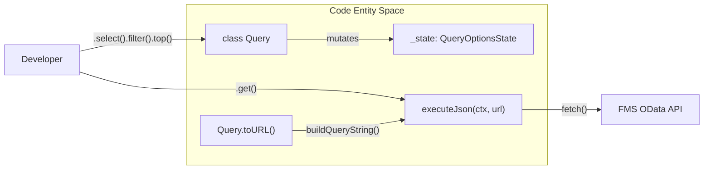

# Glossary

This page provides definitions for the terminology, architectural concepts, and abbreviations used throughout the `fms-odata-js` codebase. It serves as a reference for onboarding engineers to understand how OData v4 standards intersect with FileMaker Server (FMS) specific implementations.

## Core Concepts

### FMS Quirks
Refers to the specific deviations from the OData v4 specification exhibited by FileMaker Server. The library is designed to abstract these "sharp corners" away from the consumer [README.md:19-21]().

| Quirk | Description | Library Workaround |
| :--- | :--- | :--- |
| **Auth Scheme** | FMS requires Basic Auth for OData, not Bearer tokens [docs/filemaker-quirks.md:9-13](). | `resolveAuthHeader` auto-detects and formats the header [src/http.ts:60-66](). |
| **Count Endpoint** | `/$count` suffix returns a 400 error [docs/filemaker-quirks.md:22-23](). | `Query#count()` uses the inline `?$count=true` parameter [src/query.ts:198-201](). |
| **Date Precision** | FMS may fail if milliseconds are sent in filters [docs/filemaker-quirks.md:41-43](). | `formatDateTime` strips milliseconds from ISO strings [src/url.ts:162-167](). |
| **Script Results** | All script results (numbers, booleans) are returned as strings [docs/filemaker-quirks.md:45-52](). | `ScriptResult` types `scriptResult` as `string \| undefined` [src/scripts.ts:41-43](). |

**Sources:** [docs/filemaker-quirks.md:1-65](), [src/http.ts:59-71](), [src/url.ts:162-167]()

---

### Script Scopes
FileMaker scripts can be invoked via OData Actions at three distinct levels of context. This context determines what FileMaker considers the "Current Record" or "Current Layout" during execution [src/scripts.ts:4-10]().

*   **Database Scope**: The script runs without a specific layout context (unless handled within the script) [src/scripts.ts:7]().
*   **Entity-Set Scope**: The script runs with the context of the specified Table Occurrence (Entity Set) [src/scripts.ts:8]().
*   **Record Scope**: The script runs with a specific record as the current record context [src/scripts.ts:9]().

#### Script Execution Data Flow
The following diagram bridges the natural language "Scope" to the internal `ScriptInvoker` logic.

**Diagram: Script Invocation Logic**

**Sources:** [src/scripts.ts:4-14](), [src/scripts.ts:76-123](), [src/scripts.ts:131-181]()

---

## Technical Terminology

### ODataLiteral
A TypeScript union type representing the primitive values that can be safely serialized into an OData URL or filter expression.
*   **Definition**: `string | number | boolean | Date | null` [src/url.ts:19]().
*   **Formatting**: Handled by `formatLiteral` which applies single quotes to strings and escapes internal quotes [src/url.ts:168-180]().

### HttpClientContext (`_ctx`)
An internal object passed throughout the library to maintain shared state for HTTP requests without exposing it to the end-user.
*   **Fields**: Includes `fetch` implementation, `token` provider, `timeoutMs`, and `onUnauthorized` callback [src/http.ts:97-105]().
*   **Usage**: Initialized in `FMSOData` constructor and passed to `Query`, `EntityRef`, and `ScriptInvoker` [src/query.ts:140-143]().

### Fluent Query Builder
The `Query<T>` class provides a chainable interface for building OData queries. It maintains an internal `QueryOptionsState` which is only serialized to a URL at the moment of execution [src/query.ts:121-133]().

**Diagram: Query Building to HTTP Request**

**Sources:** [src/query.ts:133-213](), [src/http.ts:138-156]()

---

### EntityRef
A handle to a single record in FileMaker, identified by its primary key. Unlike a `Query`, which returns collections, an `EntityRef` performs targeted operations like `PATCH` (update) and `DELETE` [src/entity.ts:2-10]().

### FMScriptError
A specialized subclass of `FMSODataError`. It is thrown when the HTTP request to a script action succeeds (200 OK), but the FileMaker script itself returns a non-zero error code [src/errors.ts:85-111]().
*   **scriptError**: The FileMaker error code (e.g., "101" for Record Missing) [src/errors.ts:87]().
*   **scriptResult**: The string returned by the `Exit Script` step [src/errors.ts:89]().

---

## Abbreviations

| Abbreviation | Full Name | Description |
| :--- | :--- | :--- |
| **FMS** | FileMaker Server | The host server providing the OData v4 API. |
| **ESM** | ES Module | The distribution format of the library (Standard JavaScript Modules). |
| **CRUD** | Create, Read, Update, Delete | Standard database operations mapped to POST, GET, PATCH, DELETE. |
| **TS** | TypeScript | The language used to write the library, providing type safety. |
| **CSDL** | Common Schema Definition Language | The XML format used by OData `$metadata` (Planned for M5) [README.md:40](). |

**Sources:** [README.md:1-42](), [src/errors.ts:1-111](), [src/scripts.ts:1-210]()
